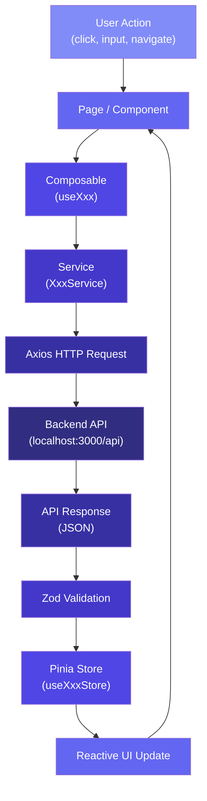
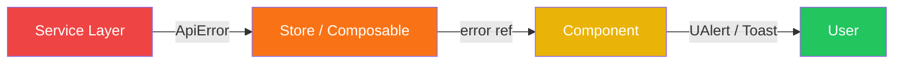
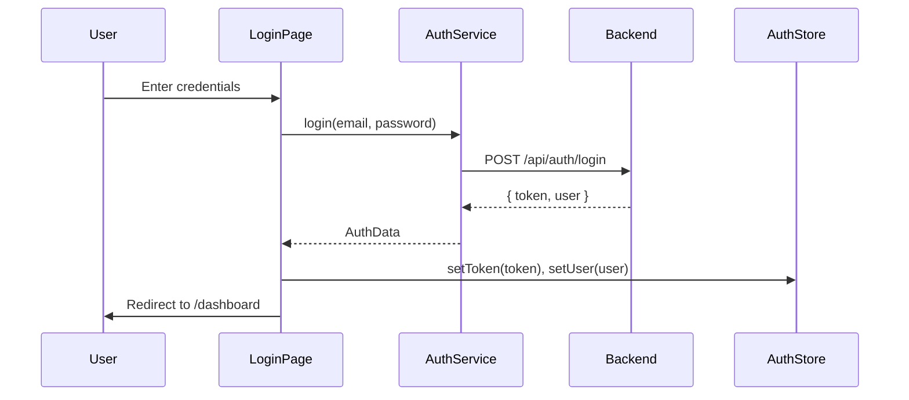
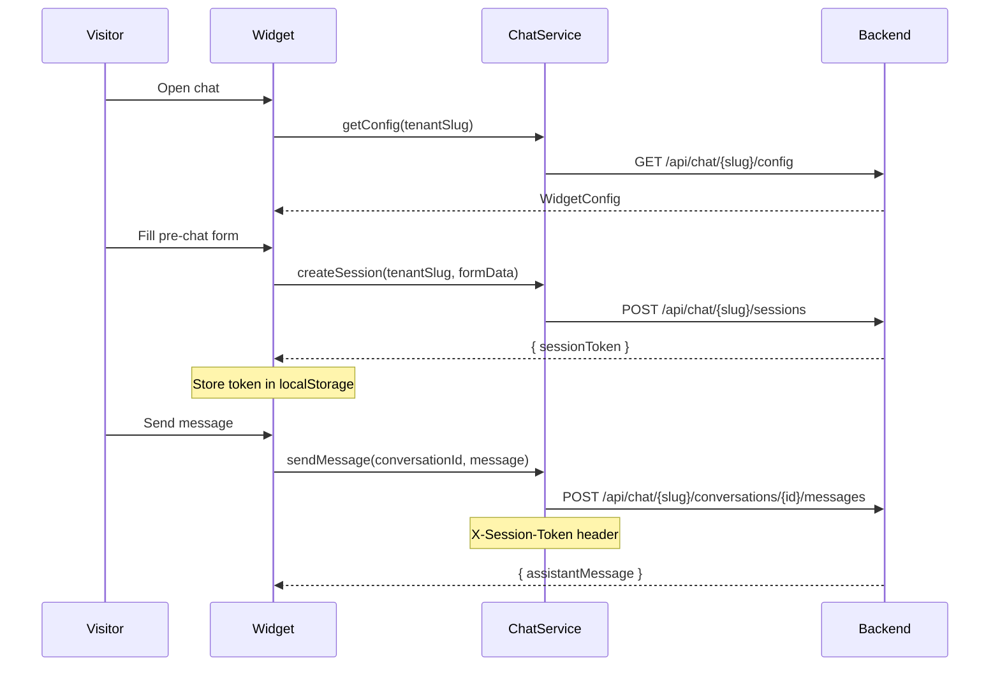

# Architecture — CRM Widget Frontend

> Dokumen ini menjelaskan arsitektur, patterns, dan conventions yang digunakan dalam project CRM Widget Frontend.

---

## 📋 Overview

CRM Widget Frontend adalah aplikasi **Nuxt 4** yang menyediakan **dua deliverable** dalam satu codebase:

| Deliverable | Deskripsi | Target User |
|---|---|---|
| **Chat Widget** | Widget chat embeddable via `<script>` tag | End-user / Visitor website |
| **Admin Dashboard** | Web app untuk mengelola chatbot | Admin / Operator |

Kedua deliverable berbagi codebase yang sama tetapi memiliki:
- Layout terpisah (`widget` vs `dashboard`)
- Route group terpisah (`/widget/` vs `/dashboard/`)
- Component terpisah (`components/widget/` vs `components/dashboard/`)
- Shared components di `components/common/`

---

## 📁 Directory Structure

```
crm-widget-fe/
├── app/                            # 🎯 Semua kode frontend
│   ├── app.vue                     # Root component — wrapper UApp
│   ├── assets/
│   │   └── css/main.css            # Tailwind v4 + NuxtUI imports
│   │
│   ├── components/                 # 🧩 Auto-imported Vue components
│   │   ├── common/                 # Shared: CommonHeader, CommonFooter, CommonLoadingState
│   │   ├── dashboard/              # Dashboard: DashboardSidebar, DashboardNavbar
│   │   │   ├── settings/           # DashboardSettingsWidgetForm
│   │   │   ├── knowledge/          # DashboardKnowledgeCategoryList
│   │   │   ├── conversations/      # DashboardConversationsTable
│   │   │   └── ...
│   │   └── widget/                 # Widget: WidgetChatBubble, WidgetMessageList
│   │       ├── WidgetChatWindow.vue
│   │       ├── WidgetMessageBubble.vue
│   │       ├── WidgetPreChatForm.vue
│   │       └── ...
│   │
│   ├── composables/                # 🔄 Auto-imported composables
│   │   ├── useAuth.ts              # Authentication logic
│   │   ├── useChat.ts              # Chat functionality
│   │   ├── useApiError.ts          # API error handling
│   │   └── ...
│   │
│   ├── layouts/                    # 📐 Layout components
│   │   ├── default.vue             # Default layout
│   │   ├── dashboard.vue           # Dashboard layout (sidebar + navbar)
│   │   └── widget.vue              # Widget layout (minimal, floating)
│   │
│   ├── middleware/                  # 🛡 Route middleware
│   │   ├── auth.ts                 # Protect dashboard routes
│   │   └── guest.ts                # Redirect if already authenticated
│   │
│   ├── pages/                      # 📄 File-based routing
│   │   ├── index.vue               # Landing / redirect
│   │   ├── login.vue               # Login page
│   │   ├── dashboard/              # Dashboard pages
│   │   │   ├── index.vue           # Dashboard home
│   │   │   ├── widget-settings.vue
│   │   │   ├── chatbot-settings.vue
│   │   │   ├── form-fields.vue
│   │   │   ├── knowledge/
│   │   │   │   ├── index.vue       # Knowledge categories
│   │   │   │   └── [categoryId].vue
│   │   │   ├── conversations/
│   │   │   │   ├── index.vue       # Conversation list
│   │   │   │   └── [id].vue        # Conversation detail
│   │   │   ├── sessions.vue
│   │   │   ├── playground.vue
│   │   │   └── embed-code.vue
│   │   └── widget/                 # Widget pages
│   │       └── [tenantSlug].vue    # Widget entry point
│   │
│   ├── plugins/                    # 🔌 Vue plugins
│   │   └── axios.ts                # Axios instance setup
│   │
│   ├── services/                   # 🌐 API service classes
│   │   ├── BaseApiService.ts       # Base class with Axios instance
│   │   ├── AuthService.ts          # Authentication API
│   │   ├── WidgetSettingsService.ts
│   │   ├── ChatbotSettingsService.ts
│   │   ├── FormFieldService.ts
│   │   ├── KnowledgeService.ts
│   │   ├── ConversationService.ts
│   │   ├── SessionService.ts
│   │   ├── PlaygroundService.ts
│   │   └── ChatService.ts          # Public chat API (widget)
│   │
│   ├── stores/                     # 🏪 Pinia stores
│   │   ├── useAuthStore.ts         # Auth state + JWT token
│   │   ├── useChatStore.ts         # Chat widget state
│   │   ├── useWidgetSettingsStore.ts
│   │   ├── useChatbotSettingsStore.ts
│   │   └── ...
│   │
│   └── utils/                      # 🔧 Utility functions
│       ├── formatters.ts           # Date, number formatters
│       ├── validators.ts           # Common Zod schemas
│       └── constants.ts            # App-wide constants
│
├── server/                         # Server-side (API routes, middleware)
│
├── shared/                         # 📦 Shared between app/ and server/
│   └── types/                      # TypeScript interfaces & types
│       ├── api.ts                  # ApiResponse, ApiError, PaginationMeta
│       ├── auth.ts                 # LoginPayload, AuthData, User
│       ├── widget-settings.ts      # WidgetSettings
│       ├── chatbot-settings.ts     # ChatbotSettings
│       ├── form-field.ts           # FormField, FormFieldType
│       ├── knowledge.ts            # KnowledgeCategory, KnowledgeBase
│       ├── conversation.ts         # Conversation, Message
│       ├── session.ts              # ChatSession
│       └── index.ts                # Re-export semua types
│
├── public/                         # Static assets
├── docs/                           # Documentation
│   ├── PRD_CHATBOT.md              # Product Requirements Document
│   └── swagger.yml                 # OpenAPI 3.1.0 Specification
│
├── app.config.ts                   # Runtime config (theme, UI tokens)
├── nuxt.config.ts                  # Build-time Nuxt configuration
├── tsconfig.json                   # TypeScript configuration
└── package.json                    # Dependencies & scripts
```

---

## 🏛 Architecture Layers

### Layer 1: Pages (`app/pages/`)

**Routing layer** — File-based routing dari Nuxt 4.

- Setiap file `.vue` menjadi route secara otomatis
- Menentukan layout yang digunakan (`definePageMeta`)
- Memanggil composables dan stores
- **TIDAK** berisi business logic kompleks

```vue
<script setup lang="ts">
definePageMeta({
  layout: 'dashboard',
  middleware: ['auth'],
})

const settingsStore = useWidgetSettingsStore()
await settingsStore.fetch()
</script>

<template>
  <div class="space-y-6">
    <h1 class="text-2xl font-bold">Widget Settings</h1>
    <DashboardSettingsWidgetForm />
  </div>
</template>
```

### Layer 2: Components (`app/components/`)

**UI layer** — Auto-imported Vue components.

- Mengikuti **Atomic Design** pattern: atoms → molecules → organisms
- **WAJIB** menggunakan NuxtUI components
- **DILARANG** hardcode CSS values
- Organized per feature domain

```
components/
├── common/           # Atoms & shared molecules
│   ├── CommonLoadingState.vue
│   ├── CommonEmptyState.vue
│   ├── CommonErrorState.vue
│   └── CommonConfirmDialog.vue
├── dashboard/        # Dashboard organisms
│   ├── DashboardSidebar.vue
│   └── settings/
│       └── DashboardSettingsWidgetForm.vue
└── widget/           # Widget organisms
    ├── WidgetChatWindow.vue
    └── WidgetMessageBubble.vue
```

**Naming convention**: `<Domain><Feature><Element>.vue`
- `DashboardSettingsWidgetForm.vue` → `<DashboardSettingsWidgetForm />`
- `WidgetChatWindow.vue` → `<WidgetChatWindow />`
- `CommonLoadingState.vue` → `<CommonLoadingState />`

### Layer 3: Composables (`app/composables/`)

**Business logic layer** — Reusable composition functions.

- Auto-imported oleh Nuxt
- Prefix `use` wajib
- Mengorkestrasi services dan stores
- Berisi reactive state dan computed properties

```typescript
/**
 * Composable for authentication logic.
 * Handles login, logout, and auth state management.
 */
export function useAuth() {
  const authStore = useAuthStore()
  const router = useRouter()

  async function login(payload: LoginPayload): Promise<void> {
    const data = await AuthService.login(payload)
    authStore.setToken(data.token)
    authStore.setUser(data.user)
    await router.push('/dashboard')
  }

  async function logout(): Promise<void> {
    authStore.clearAuth()
    await router.push('/login')
  }

  return {
    user: computed(() => authStore.user),
    isAuthenticated: computed(() => authStore.isAuthenticated),
    login,
    logout,
  }
}
```

### Layer 4: Services (`app/services/`)

**API communication layer** — Axios-based service classes.

- Satu service per domain/resource
- Extends `BaseApiService`
- Zod validation pada response
- Return typed data (bukan raw AxiosResponse)

```typescript
/**
 * Service for Widget Settings API operations.
 */
class WidgetSettingsService extends BaseApiService {
  /**
   * Fetch current widget settings.
   */
  async getSettings(): Promise<WidgetSettings> {
    const response = await this.http.get('/widget-settings')
    return widgetSettingsResponseSchema.parse(response.data).data
  }

  /**
   * Update widget settings.
   */
  async updateSettings(payload: UpdateWidgetSettingsPayload): Promise<WidgetSettings> {
    const response = await this.http.put('/widget-settings', payload)
    return widgetSettingsResponseSchema.parse(response.data).data
  }
}

export default new WidgetSettingsService()
```

### Layer 5: Stores (`app/stores/`)

**State management layer** — Pinia stores.

- Satu store per feature domain
- Composition API style (`setup()` function)
- Prefix `use` + suffix `Store`
- Berisi state, getters (computed), dan actions

```typescript
/**
 * Store for authentication state management.
 */
export const useAuthStore = defineStore('auth', () => {
  // State
  const token = ref<string | null>(null)
  const user = ref<User | null>(null)

  // Getters
  const isAuthenticated = computed(() => !!token.value)

  // Actions
  function setToken(newToken: string) {
    token.value = newToken
  }

  function setUser(newUser: User) {
    user.value = newUser
  }

  function clearAuth() {
    token.value = null
    user.value = null
  }

  return {
    token,
    user,
    isAuthenticated,
    setToken,
    setUser,
    clearAuth,
  }
})
```

### Layer 6: Types (`shared/types/`)

**Type definition layer** — TypeScript interfaces dan types.

- Shared antara `app/` dan `server/`
- Satu file per domain
- Re-export semua dari `index.ts`
- Mengikuti backend schema (dari `swagger.yml`)

```typescript
// shared/types/api.ts

/** Standard API response wrapper */
export interface ApiResponse<T> {
  success: boolean
  statusCode: number
  message: string
  data: T
}

/** Paginated API response */
export interface PaginatedResponse<T> extends ApiResponse<T[]> {
  meta: PaginationMeta
}

/** Pagination metadata */
export interface PaginationMeta {
  total: number
  perPage: number
  currentPage: number
  lastPage: number
  from: number
  to: number
}
```

### Layer 7: Utils (`app/utils/`)

**Utility layer** — Pure functions dan constants.

- Auto-imported oleh Nuxt
- Tidak memiliki side effects
- Stateless helper functions

```typescript
// app/utils/formatters.ts

/**
 * Format date to localized string.
 */
export function formatDate(date: string | Date): string {
  return new Intl.DateTimeFormat('id-ID', {
    year: 'numeric',
    month: 'long',
    day: 'numeric',
  }).format(new Date(date))
}

/**
 * Truncate text with ellipsis.
 */
export function truncateText(text: string, maxLength: number): string {
  if (text.length <= maxLength) return text
  return `${text.slice(0, maxLength)}...`
}
```

---

## 🔄 Data Flow



### Data Flow Summary

1. **User** melakukan aksi (click, input, navigate)
2. **Page/Component** menangkap event
3. **Composable** mengorkestrasi business logic
4. **Service** melakukan HTTP request via Axios
5. **Backend** memproses dan mengembalikan response
6. **Zod** memvalidasi response schema
7. **Store** menyimpan data ke reactive state
8. **UI** otomatis update via Vue reactivity

---

## 🌐 API Integration Pattern

### BaseApiService

Semua service extends dari `BaseApiService` yang menyediakan Axios instance dengan interceptors.

```typescript
import axios from 'axios'
import type { AxiosInstance, InternalAxiosRequestConfig, AxiosError } from 'axios'

/**
 * Base API service with shared Axios configuration.
 * All domain services must extend this class.
 */
class BaseApiService {
  protected readonly http: AxiosInstance

  constructor() {
    const config = useRuntimeConfig()

    this.http = axios.create({
      baseURL: config.public.apiBaseUrl as string,
      timeout: 30000,
      headers: {
        'Content-Type': 'application/json',
        'Accept': 'application/json',
      },
    })

    this.setupInterceptors()
  }

  /**
   * Setup request & response interceptors.
   */
  private setupInterceptors(): void {
    // Request: Attach JWT token
    this.http.interceptors.request.use(
      (config: InternalAxiosRequestConfig) => {
        const authStore = useAuthStore()
        if (authStore.token) {
          config.headers.Authorization = `Bearer ${authStore.token}`
        }
        return config
      },
    )

    // Response: Handle errors globally
    this.http.interceptors.response.use(
      (response) => response,
      (error: AxiosError) => {
        if (error.response?.status === 401) {
          const authStore = useAuthStore()
          authStore.clearAuth()
          navigateTo('/login')
        }
        return Promise.reject(new ApiError(error))
      },
    )
  }
}
```

### Domain Services

Satu service per domain/resource:

| Service | Endpoint Base | Deskripsi |
|---|---|---|
| `AuthService` | `/auth` | Login, register, logout |
| `WidgetSettingsService` | `/widget-settings` | Widget UI configuration |
| `ChatbotSettingsService` | `/chatbot-settings` | AI model configuration |
| `FormFieldService` | `/chatbot-form-fields` | Pre-chat form builder |
| `KnowledgeService` | `/knowledge-categories`, `/knowledge-bases` | Knowledge base CRUD |
| `ConversationService` | `/chatbot-conversations` | Chat history |
| `SessionService` | `/chatbot-sessions` | Active sessions |
| `PlaygroundService` | `/playground` | Test chatbot |
| `ChatService` | `/chat/{tenantSlug}` | Public widget API |

### Zod Response Validation

Setiap API response divalidasi dengan Zod schema:

```typescript
import { z } from 'zod'

/** Zod schema for standard API response */
const apiResponseSchema = <T extends z.ZodType>(dataSchema: T) =>
  z.object({
    success: z.boolean(),
    statusCode: z.number(),
    message: z.string(),
    data: dataSchema,
  })

/** Zod schema for widget settings */
const widgetSettingsSchema = z.object({
  id: z.string().uuid(),
  primaryColor: z.string(),
  fontFamily: z.string(),
  welcomeMessage: z.string(),
  // ...
})

/** Combined response schema */
const widgetSettingsResponseSchema = apiResponseSchema(widgetSettingsSchema)
```

### Custom ApiError Class

```typescript
/**
 * Custom error class for API errors.
 * Extracts meaningful error data from AxiosError.
 */
export class ApiError extends Error {
  public readonly statusCode: number
  public readonly errors: Record<string, string[]> | null

  constructor(axiosError: AxiosError) {
    const responseData = axiosError.response?.data as ApiErrorResponse | undefined
    super(responseData?.message ?? axiosError.message)

    this.statusCode = axiosError.response?.status ?? 500
    this.errors = responseData?.errors ?? null
    this.name = 'ApiError'
  }
}
```

---

## 🏪 State Management with Pinia

### Store Organization

| Store | Domain | Data yang disimpan |
|---|---|---|
| `useAuthStore` | Authentication | JWT token, user data |
| `useChatStore` | Chat Widget | Messages, conversation, session |
| `useWidgetSettingsStore` | Widget Settings | Colors, fonts, welcome message |
| `useChatbotSettingsStore` | Chatbot Settings | Model, temperature, system instruction |
| `useFormFieldStore` | Form Fields | Custom form field definitions |
| `useKnowledgeStore` | Knowledge Base | Categories, entries |
| `useConversationStore` | Conversations | Conversation list, messages |
| `useSessionStore` | Sessions | Active session list |

### Store Pattern (Composition API)

Semua store menggunakan **Composition API style** (bukan Options API):

```typescript
export const useExampleStore = defineStore('example', () => {
  // 📦 State (ref)
  const items = ref<Item[]>([])
  const loading = ref(false)
  const error = ref<string | null>(null)

  // 🔍 Getters (computed)
  const itemCount = computed(() => items.value.length)
  const hasItems = computed(() => items.value.length > 0)

  // ⚡ Actions (functions)
  async function fetchItems() {
    loading.value = true
    error.value = null
    try {
      items.value = await ExampleService.getAll()
    }
    catch (err) {
      error.value = (err as ApiError).message
    }
    finally {
      loading.value = false
    }
  }

  function clearItems() {
    items.value = []
  }

  return {
    // State
    items,
    loading,
    error,
    // Getters
    itemCount,
    hasItems,
    // Actions
    fetchItems,
    clearItems,
  }
})
```

---

## 🧩 Component Design

### Atomic Design Hierarchy

```
Atoms (NuxtUI primitives)
  └── UButton, UInput, UBadge, UIcon, UAvatar

Molecules (common/ components)
  └── CommonLoadingState, CommonEmptyState, CommonConfirmDialog

Organisms (feature components)
  └── DashboardSettingsWidgetForm, WidgetChatWindow, DashboardConversationsTable

Templates (layouts)
  └── DashboardLayout, WidgetLayout

Pages (pages/)
  └── Full page compositions
```

### Component Rules

1. **Maximize NuxtUI usage** — Gunakan UButton, UInput, UCard, UTable, UModal, UDropdown, dll.
2. **NO hardcoded CSS** — Gunakan hanya Tailwind utility classes yang sudah ada
3. **Props validation** — Gunakan `defineProps` dengan TypeScript types
4. **Emit typing** — Gunakan `defineEmits` dengan TypeScript
5. **Auto-import** — JANGAN manual import components

```vue
<script setup lang="ts">
/**
 * Chat message bubble component.
 * Renders a single message with appropriate styling based on role.
 */

interface Props {
  /** The message content (supports Markdown) */
  content: string
  /** Role of the message sender */
  role: 'user' | 'assistant'
  /** Timestamp of the message */
  timestamp: string
}

const props = defineProps<Props>()
</script>

<template>
  <div
    class="flex gap-3"
    :class="props.role === 'user' ? 'justify-end' : 'justify-start'"
  >
    <UCard
      class="max-w-xs"
      :ui="{
        body: { padding: 'p-3' },
      }"
    >
      <div class="text-sm" v-html="renderMarkdown(props.content)" />
      <p class="text-xs text-gray-500 mt-1">
        {{ formatDate(props.timestamp) }}
      </p>
    </UCard>
  </div>
</template>
```

---

## 📛 Naming Conventions

| Item | Convention | Contoh |
|---|---|---|
| **Components** | PascalCase, `<Domain><Feature><Element>` | `DashboardSettingsWidgetForm.vue` |
| **Composables** | camelCase, prefix `use` | `useAuth.ts`, `useChat.ts` |
| **Stores** | camelCase, prefix `use` + suffix `Store` | `useAuthStore.ts` |
| **Services** | PascalCase, suffix `Service` | `AuthService.ts`, `ChatService.ts` |
| **Types/Interfaces** | PascalCase, suffix by kind | `AuthResponse`, `UserEntity`, `LoginPayload` |
| **Utils** | camelCase | `formatDate`, `truncateText` |
| **Pages** | kebab-case | `widget-settings.vue`, `form-fields.vue` |
| **Layouts** | kebab-case | `dashboard.vue`, `widget.vue` |
| **Middleware** | kebab-case / camelCase | `auth.ts`, `guest.ts` |
| **CSS classes** | Tailwind utilities only | `flex items-center gap-3 p-4` |
| **Icons** | `i-lucide-<name>` | `i-lucide-home`, `i-lucide-settings` |

---

## ⚠️ Error Handling Strategy

### Layer-by-Layer Error Handling



### 1. Service Layer — Throw ApiError

```typescript
// Service throws ApiError automatically via Axios interceptor
const data = await ExampleService.getAll() // throws ApiError on failure
```

### 2. Store/Composable Layer — Catch & Store Error

```typescript
async function fetchItems() {
  loading.value = true
  error.value = null
  try {
    items.value = await ExampleService.getAll()
  }
  catch (err) {
    error.value = (err as ApiError).message
    // Optional: show toast notification
    const toast = useToast()
    toast.add({
      title: 'Error',
      description: (err as ApiError).message,
      color: 'error',
    })
  }
  finally {
    loading.value = false
  }
}
```

### 3. Component Layer — Show UI Feedback

```vue
<template>
  <!-- Loading State -->
  <CommonLoadingState v-if="store.loading" />

  <!-- Error State -->
  <CommonErrorState
    v-else-if="store.error"
    :message="store.error"
    @retry="store.fetchItems"
  />

  <!-- Empty State -->
  <CommonEmptyState
    v-else-if="!store.hasItems"
    title="No items found"
    description="Create your first item to get started."
    icon="i-lucide-inbox"
  />

  <!-- Data -->
  <div v-else>
    <!-- Render data -->
  </div>
</template>
```

### HTTP Status Code Handling

| Status | Action |
|---|---|
| `200-299` | Success — update store |
| `400` | Validation error — show field errors |
| `401` | Unauthorized — clear auth, redirect to login |
| `403` | Forbidden — show access denied message |
| `404` | Not found — show not found state |
| `422` | Unprocessable — show validation errors |
| `429` | Rate limited — show retry message |
| `500+` | Server error — show generic error + retry button |

---

## 🔑 Authentication Flow

### Admin Dashboard (JWT)



### Chat Widget (Session Token)



---

## 🎨 Theme & Design Tokens

Design tokens dikonfigurasi di `app.config.ts` dan mengikuti NuxtUI theming system:

```typescript
// app.config.ts
export default defineAppConfig({
  ui: {
    colors: {
      primary: 'indigo',   // Default primary color
      neutral: 'slate',    // Default neutral color
    },
  },
})
```

Widget colors bersifat **dynamic** — diambil dari Widget Settings API dan diterapkan via CSS custom properties.

---

## 📖 Further Reading

- [Nuxt 4 Documentation](https://nuxt.com/docs)
- [NuxtUI Documentation](https://ui.nuxt.com/)
- [Pinia Documentation](https://pinia.vuejs.org/)
- [TailwindCSS v4](https://tailwindcss.com/docs)
- [Zod Documentation](https://zod.dev/)
- [PRD Chatbot](./docs/PRD_CHATBOT.md)
- [API Specification](./docs/swagger.yml)
