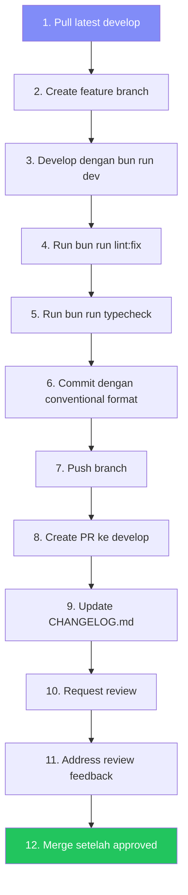

# Contributing — CRM Widget Frontend

> Panduan lengkap untuk berkontribusi pada project **CRM Widget Frontend**.
> Dokumen ini ditulis dalam Bahasa Indonesia dengan istilah teknis dalam Bahasa Inggris.

---

## 📋 Daftar Isi

- [Git Workflow](#-git-workflow)
- [Commit Message Format](#-commit-message-format)
- [Pull Request (PR) Conventions](#-pull-request-pr-conventions)
- [Development Workflow](#-development-workflow)
- [Code Review Checklist](#-code-review-checklist)
- [Versioning](#-versioning)

---

## 🌿 Git Workflow

### Branch Strategy

Project ini menggunakan **Git Flow** yang disederhanakan dengan dua branch utama:

| Branch | Fungsi | Protected |
|--------|--------|-----------|
| `main` | Production-ready code | ✅ Yes |
| `develop` | Integration branch untuk development | ✅ Yes |

### Branch Naming Convention

Semua feature branch **HARUS** dibuat dari `develop` dan mengikuti format berikut:

```
<type>/<scope>/<short-description>
```

| Type | Deskripsi | Contoh |
|------|-----------|--------|
| `feature` | Fitur baru | `feature/dashboard/widget-settings-page` |
| `fix` | Perbaikan bug | `fix/widget/session-expired-redirect` |
| `refactor` | Refactoring tanpa perubahan behavior | `refactor/services/extract-base-pagination` |
| `docs` | Perubahan dokumentasi saja | `docs/update-architecture-diagram` |
| `chore` | Maintenance, config, tooling | `chore/update-eslint-rules` |

#### Aturan Penamaan Branch

- Gunakan **lowercase** dan **kebab-case**
- `<scope>` mengikuti domain fitur: `dashboard`, `widget`, `services`, `stores`, `composables`, `types`, `config`
- `<short-description>` singkat dan deskriptif (2–5 kata)
- Untuk `docs` dan `chore`, scope bersifat opsional

#### Contoh Branch Names

```bash
# ✅ Benar
feature/dashboard/widget-settings-page
feature/widget/pre-chat-form
fix/widget/session-expired-redirect
fix/dashboard/pagination-reset-on-filter
refactor/services/extract-pagination-logic
refactor/stores/auth-store-composition-api
docs/update-changelog
chore/update-nuxt-dependencies

# ❌ Salah
Feature/Dashboard/WidgetSettings     # PascalCase
feature-widget-prechat               # Tanpa scope/separator
bugfix/typo                           # Gunakan 'fix' bukan 'bugfix'
wip/something                        # 'wip' bukan tipe yang valid
```

### Branch Lifecycle

```mermaid
gitgraph
    commit id: "initial"
    branch develop
    commit id: "setup"
    branch feature/dashboard/widget-settings
    commit id: "feat: add form"
    commit id: "feat: add validation"
    checkout develop
    merge feature/dashboard/widget-settings id: "PR #1"
    branch feature/widget/pre-chat-form
    commit id: "feat: add pre-chat"
    checkout develop
    merge feature/widget/pre-chat-form id: "PR #2"
    checkout main
    merge develop id: "Release v0.2.0"
```

---

## 📝 Commit Message Format

### Conventional Commits

Semua commit **WAJIB** mengikuti format [Conventional Commits](https://www.conventionalcommits.org/):

```
<type>(<scope>): <description>

[optional body]

[optional footer(s)]
```

### Type

| Type | Deskripsi | Contoh |
|------|-----------|--------|
| `feat` | Fitur baru | `feat(dashboard): add widget settings page` |
| `fix` | Perbaikan bug | `fix(widget): handle session expired redirect` |
| `docs` | Perubahan dokumentasi | `docs: update CHANGELOG.md for v0.2.0` |
| `style` | Formatting, whitespace (bukan CSS) | `style(dashboard): fix indentation in sidebar` |
| `refactor` | Refactoring tanpa perubahan behavior | `refactor(services): extract pagination logic to base service` |
| `test` | Menambah/memperbaiki tests | `test(stores): add auth store unit tests` |
| `chore` | Maintenance, tooling | `chore(config): update ESLint rules` |
| `perf` | Peningkatan performa | `perf(widget): lazy load message history` |
| `ci` | Perubahan CI/CD | `ci: add GitHub Actions workflow` |
| `build` | Perubahan build system | `build: upgrade Nuxt to 4.5.0` |

### Scope

Scope menunjukkan area kode yang terpengaruh:

| Scope | Area | Contoh File |
|-------|------|-------------|
| `dashboard` | Dashboard pages & components | `app/pages/dashboard/`, `app/components/dashboard/` |
| `widget` | Widget pages & components | `app/pages/widget/`, `app/components/widget/` |
| `services` | API service classes | `app/services/` |
| `stores` | Pinia stores | `app/stores/` |
| `composables` | Composable functions | `app/composables/` |
| `types` | TypeScript type definitions | `shared/types/` |
| `config` | Configuration files | `nuxt.config.ts`, `app.config.ts`, `eslint.config.mjs` |
| `docs` | Documentation | `docs/`, `*.md` |

> **Note:** Scope bersifat opsional untuk `docs` dan `chore` yang bersifat umum.

### Aturan Penulisan

1. **Description** harus lowercase, tanpa titik di akhir
2. **Description** menggunakan imperative mood ("add", bukan "added" atau "adds")
3. Maksimal **72 karakter** untuk baris pertama
4. **Body** opsional, gunakan untuk penjelasan detail (pisahkan dengan baris kosong)
5. **Footer** untuk breaking changes dan referensi issue

### Contoh Lengkap

#### Simple Commit

```
feat(dashboard): add widget settings page
```

#### Commit dengan Body

```
fix(widget): handle session expired redirect

Saat session token expired, widget sekarang mendeteksi 401 response
dan mengarahkan user kembali ke pre-chat form untuk membuat session baru.
Sebelumnya widget menampilkan error tanpa recovery path.
```

#### Commit dengan Breaking Change

```
refactor(services): migrate BaseApiService to composition pattern

BREAKING CHANGE: BaseApiService sekarang abstract class.
Semua service harus extend class ini dan tidak bisa lagi
menggunakan standalone Axios instance.

Perubahan yang diperlukan:
- Ganti `new AxiosService()` dengan `class XxxService extends BaseApiService`
- Update semua import paths
```

#### Commit dengan Issue Reference

```
fix(dashboard): resolve pagination reset on filter change

Fixes #42
```

---

## 🔀 Pull Request (PR) Conventions

### PR Title

PR title **HARUS** mengikuti format Conventional Commits yang sama:

```
feat(dashboard): add widget settings page
fix(widget): handle session expired redirect
docs: update CHANGELOG.md for v0.2.0
```

### PR Description Template

Gunakan template berikut untuk setiap PR:

```markdown
## What — Apa yang Berubah

Jelaskan secara singkat perubahan yang dilakukan.

## Why — Kenapa Perubahan Ini Diperlukan

Jelaskan masalah yang dipecahkan atau fitur yang ditambahkan.
Link ke issue jika ada: Fixes #XX

## How — Bagaimana Implementasinya

Jelaskan pendekatan teknis yang digunakan:
- Komponen/file apa yang ditambah/diubah
- Pattern/library apa yang digunakan
- Keputusan arsitektur yang diambil

## Testing — Cara Test Perubahan Ini

Langkah-langkah untuk menguji perubahan:
1. Buka halaman X
2. Klik tombol Y
3. Verifikasi Z terjadi

## Screenshots

Jika ada perubahan UI, sertakan screenshot atau screen recording:
- Desktop view
- Mobile view (jika relevan)

| Before | After |
|--------|-------|
| (screenshot) | (screenshot) |
```

### PR Checklist

Sebelum request review, pastikan semua checklist terpenuhi:

```markdown
### Checklist

- [ ] Code mengikuti coding standards (`docs/CODING_STANDARDS.md`)
- [ ] TypeScript types terdefinisi dengan benar (tidak ada `any`)
- [ ] Menggunakan NuxtUI components (bukan native HTML untuk komponen yang sudah ada)
- [ ] Tidak ada hardcoded CSS values (`p-[10px]`, `mt-[5px]`, `w-[200px]`, `text-[14px]`, `bg-[#fff]`, dll.)
- [ ] `CHANGELOG.md` sudah di-update
- [ ] Tested di mobile dan desktop
- [ ] Error states ter-handle (loading, error, empty)
- [ ] Lint passed (`bun run lint:fix`)
- [ ] Type check passed (`bun run typecheck`)
```

### PR Review Process

1. **Author** membuat PR ke `develop`
2. **Reviewer** melakukan code review menggunakan checklist
3. **Reviewer** approve atau request changes
4. Jika ada changes, **Author** memperbaiki dan push ulang
5. Setelah approved, **Author** melakukan merge (squash merge direkomendasikan)
6. Branch otomatis dihapus setelah merge

---

## 🛠 Development Workflow

### Langkah-Langkah Development



### Detail Setiap Langkah

#### 1. Pull Latest `develop`

```bash
git checkout develop
git pull origin develop
```

#### 2. Create Feature Branch

```bash
git checkout -b feature/dashboard/widget-settings-page
```

#### 3. Develop

```bash
bun run dev
```

Development server berjalan di `http://localhost:3001` (default Nuxt).
Backend API di `http://localhost:3000/api` (pastikan backend sudah running).

#### 4. Lint & Fix

```bash
# Fix auto-fixable issues
bun run lint:fix

# Check tanpa fixing (untuk CI)
bun run lint
```

#### 5. Type Check

```bash
bun run typecheck
```

Pastikan tidak ada TypeScript error sebelum push.

#### 6. Commit

```bash
git add .
git commit -m "feat(dashboard): add widget settings page"
```

#### 7. Push Branch

```bash
git push origin feature/dashboard/widget-settings-page
```

#### 8. Create Pull Request

Buat PR di GitHub/GitLab dari feature branch ke `develop`. Isi description sesuai template.

#### 9. Update CHANGELOG.md

Tambahkan entry di section `[Unreleased]`:

```markdown
## [Unreleased]

### Added
- Widget settings page di dashboard (`feat(dashboard): add widget settings page`)
```

#### 10–12. Review & Merge

Tunggu review, address feedback, dan merge setelah approved.

### Available Scripts

| Script | Command | Deskripsi |
|--------|---------|-----------|
| Dev Server | `bun run dev` | Jalankan development server |
| Build | `bun run build` | Build untuk production |
| Preview | `bun run preview` | Preview production build |
| Lint | `bun run lint` | Check linting errors |
| Lint Fix | `bun run lint:fix` | Fix linting errors otomatis |
| Type Check | `bun run typecheck` | Jalankan TypeScript type checking |
| Generate | `bun run generate` | Generate static site |
| Postinstall | `bun run postinstall` | Prepare Nuxt (auto-run after install) |

---

## ✅ Code Review Checklist

Reviewer **HARUS** memverifikasi hal-hal berikut:

### TypeScript & Types

- [ ] Semua variable, parameter, dan return value memiliki type yang benar
- [ ] Tidak ada penggunaan `any` — gunakan `unknown` jika type tidak diketahui
- [ ] Interface didefinisikan untuk semua data structure baru
- [ ] Zod schema digunakan untuk validasi runtime jika diperlukan
- [ ] Generics digunakan dengan benar untuk reusable functions

### NuxtUI & Styling

- [ ] Menggunakan NuxtUI components (`UButton`, `UInput`, `UCard`, `UTable`, `UModal`, dll.)
- [ ] **TIDAK ADA** native HTML untuk komponen yang sudah ada di NuxtUI
  - ❌ `<button>` → ✅ `<UButton>`
  - ❌ `<input>` → ✅ `<UInput>`
  - ❌ `<select>` → ✅ `<USelect>`
  - ❌ `<table>` → ✅ `<UTable>`
- [ ] **TIDAK ADA** hardcoded CSS arbitrary values:
  - ❌ `p-[10px]`, `mt-[5px]`, `w-[200px]`, `text-[14px]`, `bg-[#fff]`
  - ✅ `p-2.5`, `mt-1`, `w-52`, `text-sm`, `bg-white`
- [ ] Menggunakan Tailwind utility classes yang sudah ada
- [ ] Menggunakan semantic color tokens (`text-primary`, `bg-muted`, dll.)

### Error Handling & UX

- [ ] Loading states ditampilkan saat async operations
- [ ] Error states ter-handle dan ditampilkan ke user
- [ ] Empty states ditampilkan saat data kosong
- [ ] Toast notifications untuk user-facing errors
- [ ] Form validation errors ditampilkan per field

### Architecture & Patterns

- [ ] Mengikuti layer pattern: Page → Component → Composable → Service → Store
- [ ] Composable functions di-prefix dengan `use`
- [ ] Service classes extend `BaseApiService`
- [ ] Store menggunakan Composition API style
- [ ] File organization sesuai domain

### Documentation

- [ ] `CHANGELOG.md` di-update untuk perubahan yang visible ke user
- [ ] JSDoc comment pada public functions dan classes
- [ ] Inline comment pada logic yang kompleks
- [ ] File header comment menjelaskan purpose

### Responsive Design

- [ ] UI bekerja di desktop (≥1024px)
- [ ] UI bekerja di tablet (≥768px)
- [ ] UI bekerja di mobile (≥320px)
- [ ] Tidak ada horizontal scroll yang tidak disengaja
- [ ] Text readable di semua screen size

---

## 🔖 Versioning

### Semantic Versioning (SemVer)

Project ini mengikuti [Semantic Versioning 2.0.0](https://semver.org/):

```
MAJOR.MINOR.PATCH
```

| Segment | Kapan Dinaikkan | Contoh |
|---------|-----------------|--------|
| **MAJOR** | Breaking changes — perubahan yang tidak backward-compatible | `1.0.0` → `2.0.0` |
| **MINOR** | Fitur baru yang backward-compatible | `1.0.0` → `1.1.0` |
| **PATCH** | Bug fixes yang backward-compatible | `1.0.0` → `1.0.1` |

### Contoh Kenaikan Versi

| Perubahan | Dari | Ke | Alasan |
|-----------|------|----|--------|
| Tambah halaman widget settings | `0.1.0` | `0.2.0` | Fitur baru (MINOR) |
| Fix bug pagination | `0.2.0` | `0.2.1` | Bug fix (PATCH) |
| Ubah format API response | `0.2.1` | `1.0.0` | Breaking change (MAJOR) |
| Tambah dark mode support | `1.0.0` | `1.1.0` | Fitur baru (MINOR) |
| Fix typo di welcome message | `1.1.0` | `1.1.1` | Bug fix (PATCH) |

### Pre-release Version

Selama development awal (sebelum `1.0.0`), versi `0.x.y` digunakan:

- `0.MINOR.PATCH` — MINOR bisa berisi breaking changes
- Setelah **production-ready**, naikkan ke `1.0.0`

### CHANGELOG.md Format

CHANGELOG mengikuti format [Keep a Changelog](https://keepachangelog.com/):

```markdown
## [Unreleased]

### Added
- Fitur baru yang ditambahkan

### Changed
- Perubahan pada fitur yang sudah ada

### Deprecated
- Fitur yang akan dihapus di masa depan

### Removed
- Fitur yang dihapus

### Fixed
- Bug fixes

### Security
- Perbaikan keamanan
```

---

## 📚 Referensi

- [Conventional Commits](https://www.conventionalcommits.org/)
- [Semantic Versioning](https://semver.org/)
- [Keep a Changelog](https://keepachangelog.com/)
- [ARCHITECTURE.md](./ARCHITECTURE.md) — Arsitektur project
- [docs/CODING_STANDARDS.md](./docs/CODING_STANDARDS.md) — Coding standards
- [docs/ENV_VARIABLES.md](./docs/ENV_VARIABLES.md) — Environment variables
