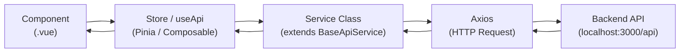

# 🌐 API Integration Guide — CRM Widget Frontend

> Panduan langkah demi langkah untuk mengintegrasikan API baru ke dalam project CRM Widget Frontend.
> Ikuti setiap langkah secara berurutan untuk memastikan konsistensi arsitektur.

---

## 📋 Daftar Isi

- [Overview](#-overview)
- [Step 1: Define Types](#-step-1-define-types-sharedtypes)
- [Step 2: Create Zod Schema](#-step-2-create-zod-schema-opsional-tapi-direkomendasikan)
- [Step 3: Create Service Class](#-step-3-create-service-class-appservices)
- [Step 4: Create Store](#-step-4-create-store-appstores--jika-shared-state-dibutuhkan)
- [Step 5: Use in Component](#-step-5-use-in-component)
- [Alternative: Direct useApi](#-alternative-langsung-pakai-useapi-tanpa-store)
- [Authentication Patterns](#-authentication-patterns)
- [Pagination Pattern](#-pagination-pattern)
- [Error Handling](#-error-handling)
- [Checklist](#-checklist-menambah-api-integration-baru)

---

## 🏗 Overview

### Arsitektur Data Flow

```
Component → Composable/Store → Service → Axios → Backend API
    ↑                                                    |
    └──── Reactive UI Update ← Pinia Store ← Response ──┘
```



### Prinsip Utama

1. **Semua service extends `BaseApiService`** — Konfigurasi Axios, interceptors, dan error handling sudah otomatis.
2. **Semua response mengikuti format standar:**
   ```json
   {
     "success": true,
     "statusCode": 200,
     "message": "Data retrieved successfully",
     "data": { ... }
   }
   ```
3. **Error handling via `ApiError` class** — Semua HTTP errors di-transform menjadi `ApiError` instance yang typed.
4. **Validasi via Zod schemas** — Opsional tapi sangat direkomendasikan untuk data integrity.
5. **TypeScript strict** — TIDAK BOLEH ada `any` types.

### File Structure untuk Satu Domain

```
shared/types/widget-settings.ts     ← 1. Type definitions
app/services/WidgetSettingsService.ts ← 2. Service class
app/stores/useWidgetSettingsStore.ts  ← 3. Pinia store (jika perlu)
app/pages/dashboard/widget-settings.vue ← 4. Page yang menggunakan
```

---

## 📝 Step 1: Define Types (`shared/types/`)

Types didefinisikan di `shared/types/` karena digunakan bersama antara `app/` dan `server/`.

### Buat File Type Baru

```typescript
// shared/types/widget-settings.ts

/**
 * Widget Settings Types
 *
 * Type definitions for the Widget Settings domain.
 * Matches the backend API contract from docs/swagger.yml.
 */

/**
 * Widget settings entity from the API
 */
export interface WidgetSettings {
  id: number
  tenantId: number
  primaryColor: string
  secondaryColor: string
  fontFamily: string
  welcomeMessage: string
  placeholderText: string
  logoUrl: string | null
  position: 'bottom-right' | 'bottom-left'
  isEnabled: boolean
  createdAt: string
  updatedAt: string
}

/**
 * Payload for creating/updating widget settings
 * (hanya field yang bisa diubah oleh user)
 */
export interface UpdateWidgetSettingsPayload {
  primaryColor: string
  secondaryColor: string
  fontFamily: string
  welcomeMessage: string
  placeholderText: string
  position: 'bottom-right' | 'bottom-left'
  isEnabled: boolean
}
```

### Tambahkan ke Barrel Export

```typescript
// shared/types/index.ts

export * from './api'
export * from './enums'
export * from './widget-settings'  // ← Tambahkan ini
```

> [!IMPORTANT]
> Setiap file type baru HARUS di-export dari `shared/types/index.ts`.
> Ini memungkinkan import yang bersih: `import type { WidgetSettings } from '~~/shared/types'`

### Referensi Type yang Sudah Ada

| File | Types | Keterangan |
|---|---|---|
| `api.ts` | `ApiResponse<T>`, `PaginatedApiResponse<T>`, `PaginationMeta`, `PaginationParams`, `ApiErrorResponse` | Response wrappers standar |
| `enums.ts` | `FormFieldType`, `EntryType`, `ConversationStatus`, `MessageRole` | Enum/literal types |

---

## 🔒 Step 2: Create Zod Schema (Opsional tapi Direkomendasikan)

Zod schema digunakan untuk:
- Validasi form input di frontend (dengan `<UForm :schema="...">`)
- Validasi API response (opsional, untuk data integrity)
- Auto-generate TypeScript types (`z.infer<typeof schema>`)

### Buat Schema untuk Form Validation

```typescript
// app/utils/schemas/widget-settings.schema.ts

import { z } from 'zod'

/**
 * Zod schema for Widget Settings form validation.
 * Digunakan dengan <UForm :schema="widgetSettingsSchema">.
 */
export const widgetSettingsSchema = z.object({
  primaryColor: z
    .string()
    .regex(/^#[0-9a-fA-F]{6}$/, 'Format warna harus #RRGGBB'),
  secondaryColor: z
    .string()
    .regex(/^#[0-9a-fA-F]{6}$/, 'Format warna harus #RRGGBB'),
  fontFamily: z
    .string()
    .min(1, 'Font family wajib diisi'),
  welcomeMessage: z
    .string()
    .min(1, 'Pesan selamat datang wajib diisi')
    .max(500, 'Maksimal 500 karakter'),
  placeholderText: z
    .string()
    .min(1, 'Placeholder text wajib diisi')
    .max(200, 'Maksimal 200 karakter'),
  position: z
    .enum(['bottom-right', 'bottom-left'], {
      message: 'Pilih posisi yang valid',
    }),
  isEnabled: z.boolean(),
})

/**
 * Type inferred from the Zod schema.
 * Bisa dipakai sebagai type untuk form state.
 */
export type WidgetSettingsFormData = z.infer<typeof widgetSettingsSchema>
```

### Schema untuk API Response Validation (Opsional)

```typescript
// Jika ingin memvalidasi response dari API:
import { z } from 'zod'

export const widgetSettingsResponseSchema = z.object({
  id: z.number(),
  tenantId: z.number(),
  primaryColor: z.string(),
  secondaryColor: z.string(),
  fontFamily: z.string(),
  welcomeMessage: z.string(),
  placeholderText: z.string(),
  logoUrl: z.string().nullable(),
  position: z.enum(['bottom-right', 'bottom-left']),
  isEnabled: z.boolean(),
  createdAt: z.string(),
  updatedAt: z.string(),
})
```

---

## 🌐 Step 3: Create Service Class (`app/services/`)

Service class menghandle komunikasi HTTP dengan backend API.

### Arsitektur BaseApiService

```
BaseApiService (abstract)
├── http: AxiosInstance         ← Axios instance ter-konfigurasi
├── getBaseUrl()               ← URL dari runtime config
├── setupInterceptors()        ← Request/response interceptors
├── getAuthToken()             ← Override untuk auth strategy
├── get<T>(url, config?)       ← GET request → ApiResponse<T>
├── getPaginated<T>(url, config?) ← GET paginated → PaginatedApiResponse<T>
├── post<T>(url, data?, config?) ← POST request → ApiResponse<T>
├── put<T>(url, data?, config?)  ← PUT request → ApiResponse<T>
└── delete<T>(url, config?)    ← DELETE request → ApiResponse<T>
```

### Buat Service Baru

```typescript
// app/services/WidgetSettingsService.ts

/**
 * Widget Settings Service
 *
 * Handles all API calls related to widget appearance settings.
 * Extends BaseApiService for shared Axios configuration.
 *
 * @see shared/types/widget-settings.ts for type definitions
 * @see docs/swagger.yml — /widget-settings endpoints
 */

import { BaseApiService } from './BaseApiService'
import type { ApiResponse } from '~~/shared/types/api'
import type { WidgetSettings, UpdateWidgetSettingsPayload } from '~~/shared/types/widget-settings'

class WidgetSettingsService extends BaseApiService {
  /**
   * Override getAuthToken untuk menggunakan JWT dari auth store.
   * Diperlukan karena widget settings hanya bisa diakses oleh admin.
   */
  protected getAuthToken(): string | null {
    try {
      const authStore = useAuthStore()
      return authStore.token
    }
    catch {
      return null
    }
  }

  /**
   * Fetch widget settings untuk tenant yang sedang login.
   *
   * GET /api/widget-settings
   */
  async getSettings(): Promise<ApiResponse<WidgetSettings>> {
    return this.get<WidgetSettings>('/widget-settings')
  }

  /**
   * Update widget settings.
   *
   * PUT /api/widget-settings
   */
  async updateSettings(payload: UpdateWidgetSettingsPayload): Promise<ApiResponse<WidgetSettings>> {
    return this.put<WidgetSettings>('/widget-settings', payload)
  }

  /**
   * Upload logo untuk widget.
   *
   * POST /api/widget-settings/logo
   */
  async uploadLogo(file: File): Promise<ApiResponse<{ logoUrl: string }>> {
    const formData = new FormData()
    formData.append('logo', file)

    return this.post<{ logoUrl: string }>('/widget-settings/logo', formData, {
      headers: { 'Content-Type': 'multipart/form-data' },
    })
  }
}

/** Singleton instance — gunakan ini di seluruh app */
export const widgetSettingsService = new WidgetSettingsService()
```

### Tambahkan ke Barrel Export

```typescript
// app/services/index.ts

export { BaseApiService } from './BaseApiService'
export { ApiError } from './ApiError'
export { widgetSettingsService } from './WidgetSettingsService'  // ← Tambahkan
```

### Method Reference dari BaseApiService

| Method | HTTP | Return Type | Penggunaan |
|---|---|---|---|
| `this.get<T>(url, config?)` | GET | `ApiResponse<T>` | Ambil satu resource |
| `this.getPaginated<T>(url, config?)` | GET | `PaginatedApiResponse<T>` | Ambil data paginasi |
| `this.post<T>(url, data?, config?)` | POST | `ApiResponse<T>` | Buat resource baru |
| `this.put<T>(url, data?, config?)` | PUT | `ApiResponse<T>` | Update resource |
| `this.delete<T>(url, config?)` | DELETE | `ApiResponse<T>` | Hapus resource |

> [!NOTE]
> Semua method sudah return `response.data` (bukan raw AxiosResponse).
> Jadi kamu mendapatkan `ApiResponse<T>` langsung, bukan `AxiosResponse<ApiResponse<T>>`.

---

## 🏪 Step 4: Create Store (`app/stores/`) — Jika Shared State Dibutuhkan

Buat Pinia store jika:
- Data digunakan di **lebih dari satu** component/page
- Perlu **caching** data agar tidak fetch ulang
- Ada **reactive state** yang perlu dishare

Jika hanya digunakan di satu component, gunakan `useApi` composable langsung (lihat [Alternative](#-alternative-langsung-pakai-useapi-tanpa-store)).

### Buat Store Baru

```typescript
// app/stores/useWidgetSettingsStore.ts

/**
 * Widget Settings Store
 *
 * Manages widget settings state for the dashboard.
 * Uses Composition API style (setup function).
 *
 * @example
 *   const store = useWidgetSettingsStore()
 *   await store.fetchSettings()
 *   console.log(store.settings)
 */

import type { WidgetSettings, UpdateWidgetSettingsPayload } from '~~/shared/types'
import { widgetSettingsService } from '~/services'
import { ApiError } from '~/services/ApiError'

export const useWidgetSettingsStore = defineStore('widgetSettings', () => {
  // ─── State ──────────────────────────────────────────────────────
  const settings = ref<WidgetSettings | null>(null)
  const loading = ref(false)
  const error = ref<string | null>(null)

  // ─── Getters ────────────────────────────────────────────────────
  const hasSettings = computed(() => settings.value !== null)
  const isWidgetEnabled = computed(() => settings.value?.isEnabled ?? false)

  // ─── Actions ────────────────────────────────────────────────────

  /**
   * Fetch widget settings dari API.
   * Biasanya dipanggil saat halaman widget-settings dimuat.
   */
  async function fetchSettings(): Promise<void> {
    loading.value = true
    error.value = null
    try {
      const response = await widgetSettingsService.getSettings()
      settings.value = response.data
    }
    catch (err) {
      error.value = (err as ApiError).message
    }
    finally {
      loading.value = false
    }
  }

  /**
   * Update widget settings.
   * Mengembalikan true jika berhasil.
   */
  async function updateSettings(payload: UpdateWidgetSettingsPayload): Promise<boolean> {
    loading.value = true
    error.value = null
    try {
      const response = await widgetSettingsService.updateSettings(payload)
      settings.value = response.data

      // Toast success notification
      const toast = useToast()
      toast.add({
        title: 'Berhasil',
        description: 'Widget settings berhasil diperbarui.',
        icon: 'i-lucide-check-circle',
        color: 'success',
      })

      return true
    }
    catch (err) {
      error.value = (err as ApiError).message

      // Toast error notification
      const toast = useToast()
      toast.add({
        title: 'Gagal',
        description: (err as ApiError).message,
        icon: 'i-lucide-alert-circle',
        color: 'error',
      })

      return false
    }
    finally {
      loading.value = false
    }
  }

  /**
   * Reset store state.
   */
  function $reset(): void {
    settings.value = null
    loading.value = false
    error.value = null
  }

  return {
    // State (readonly untuk prevent direct mutation)
    settings: readonly(settings),
    loading: readonly(loading),
    error: readonly(error),
    // Getters
    hasSettings,
    isWidgetEnabled,
    // Actions
    fetchSettings,
    updateSettings,
    $reset,
  }
})
```

### Konvensi Store

| Aspek | Aturan |
|---|---|
| Nama file | `use<Domain>Store.ts` |
| Nama store | `use<Domain>Store` |
| Store ID | `'<domain>'` (camelCase, tanpa prefix/suffix) |
| Style | **Composition API** (`setup()` function) — BUKAN Options API |
| State | `ref()` — reactive primitives |
| Getters | `computed()` — derived state |
| Actions | `async function` — business logic |
| Return | State sebagai `readonly()`, getters, dan actions |

---

## 🖥 Step 5: Use in Component

### Dengan Store (Untuk Shared State)

```vue
<!-- app/pages/dashboard/widget-settings.vue -->

<script setup lang="ts">
/**
 * Widget Settings Page
 *
 * Admin page for configuring widget appearance.
 */
definePageMeta({
  layout: 'dashboard',
  middleware: ['auth'],
})

const store = useWidgetSettingsStore()
const { settings, loading, error } = storeToRefs(store)

// Fetch data saat halaman dimuat
onMounted(() => store.fetchSettings())
</script>

<template>
  <div class="space-y-6">
    <!-- Page Header -->
    <div>
      <h1 class="text-2xl font-bold">Widget Settings</h1>
      <p class="text-sm text-gray-500 mt-1">
        Konfigurasi tampilan dan behavior chat widget Anda.
      </p>
    </div>

    <!-- Loading State -->
    <UCard v-if="loading">
      <div class="space-y-4">
        <USkeleton class="h-8 w-48" />
        <USkeleton class="h-10 w-full" />
        <USkeleton class="h-10 w-full" />
        <USkeleton class="h-10 w-full" />
      </div>
    </UCard>

    <!-- Error State -->
    <UAlert
      v-else-if="error"
      title="Gagal Memuat Settings"
      :description="error"
      icon="i-lucide-alert-circle"
      color="error"
      :actions="[{ label: 'Coba Lagi', icon: 'i-lucide-refresh-cw', onClick: () => store.fetchSettings() }]"
    />

    <!-- Settings Form -->
    <DashboardSettingsWidgetForm v-else-if="settings" :settings="settings" />
  </div>
</template>
```

### Component Form yang Menggunakan Store

```vue
<!-- app/components/dashboard/settings/DashboardSettingsWidgetForm.vue -->

<script setup lang="ts">
import { z } from 'zod'
import type { WidgetSettings } from '~~/shared/types'

interface Props {
  settings: WidgetSettings
}

const props = defineProps<Props>()
const store = useWidgetSettingsStore()

// Zod schema
const schema = z.object({
  primaryColor: z.string().regex(/^#[0-9a-fA-F]{6}$/, 'Format warna harus #RRGGBB'),
  welcomeMessage: z.string().min(1, 'Wajib diisi').max(500),
  placeholderText: z.string().min(1, 'Wajib diisi').max(200),
  position: z.enum(['bottom-right', 'bottom-left']),
  isEnabled: z.boolean(),
})

// Reactive form state dari props
const state = reactive({
  primaryColor: props.settings.primaryColor,
  welcomeMessage: props.settings.welcomeMessage,
  placeholderText: props.settings.placeholderText,
  position: props.settings.position,
  isEnabled: props.settings.isEnabled,
})

async function onSubmit() {
  await store.updateSettings(state)
}
</script>

<template>
  <UCard>
    <UForm :schema="schema" :state="state" class="space-y-4" @submit="onSubmit">
      <UFormField label="Primary Color" name="primaryColor" required>
        <UInput v-model="state.primaryColor" placeholder="#6366f1" />
      </UFormField>

      <UFormField label="Welcome Message" name="welcomeMessage" required>
        <UTextarea v-model="state.welcomeMessage" :rows="3" autoresize />
      </UFormField>

      <UFormField label="Placeholder Text" name="placeholderText" required>
        <UInput v-model="state.placeholderText" />
      </UFormField>

      <UFormField label="Widget Position" name="position" required>
        <USelect
          v-model="state.position"
          :items="[
            { label: 'Kanan Bawah', value: 'bottom-right' },
            { label: 'Kiri Bawah', value: 'bottom-left' },
          ]"
        />
      </UFormField>

      <UFormField name="isEnabled">
        <USwitch v-model="state.isEnabled" label="Aktifkan Widget" />
      </UFormField>

      <div class="flex justify-end gap-2 pt-4">
        <UButton label="Simpan" type="submit" icon="i-lucide-save" :loading="store.loading" />
      </div>
    </UForm>
  </UCard>
</template>
```

---

## 🔀 Alternative: Langsung Pakai `useApi` (Tanpa Store)

Gunakan pattern ini untuk:
- **One-off API calls** yang tidak perlu shared state
- **Simple CRUD** tanpa caching
- **Halaman sederhana** yang data-nya tidak dipakai di tempat lain

### useApi Composable

```typescript
// Signature:
function useApi(options?: {
  showErrorToast?: boolean   // default: true
  showSuccessToast?: boolean // default: false
  successMessage?: string    // default: 'Operation successful'
}): {
  loading: Readonly<Ref<boolean>>
  error: Readonly<Ref<ApiError | null>>
  execute: <T>(fn: () => Promise<T>) => Promise<T | null>
  clearError: () => void
}
```

### Contoh Penggunaan

```vue
<script setup lang="ts">
import type { WidgetSettings } from '~~/shared/types'
import { widgetSettingsService } from '~/services'

// Setup useApi dengan toast otomatis
const { loading, error, execute } = useApi({
  showSuccessToast: true,
  successMessage: 'Settings berhasil disimpan!',
})

// State lokal
const settings = ref<WidgetSettings | null>(null)

// Fetch data
async function loadSettings() {
  const result = await execute(() => widgetSettingsService.getSettings())
  if (result) {
    settings.value = result.data
  }
}

// Update data
async function saveSettings(payload: UpdateWidgetSettingsPayload) {
  const result = await execute(() => widgetSettingsService.updateSettings(payload))
  if (result) {
    settings.value = result.data
    // result !== null berarti sukses
  }
}

onMounted(() => loadSettings())
</script>

<template>
  <div>
    <!-- Loading -->
    <USkeleton v-if="loading" class="h-32 w-full" />

    <!-- Error -->
    <UAlert
      v-else-if="error"
      :title="error.message"
      color="error"
      icon="i-lucide-alert-circle"
    />

    <!-- Content -->
    <div v-else-if="settings">
      <!-- Render settings -->
    </div>
  </div>
</template>
```

### Kapan Pakai Store vs useApi?

| Kriteria | Pakai Store | Pakai useApi |
|---|---|---|
| Data dipakai di >1 component | ✅ | ❌ |
| Perlu caching/persist | ✅ | ❌ |
| Reactive state global | ✅ | ❌ |
| One-off fetch | ❌ | ✅ |
| Simple CRUD page | ❌ | ✅ |
| Form submit handler | ❌ | ✅ |

---

## 🔑 Authentication Patterns

### Dashboard (JWT Bearer Token)

Dashboard menggunakan **JWT token** yang disimpan di Pinia auth store.

```typescript
// app/services/WidgetSettingsService.ts (Dashboard service)

class WidgetSettingsService extends BaseApiService {
  /**
   * Override getAuthToken untuk menggunakan JWT dari auth store.
   */
  protected getAuthToken(): string | null {
    try {
      const authStore = useAuthStore()
      return authStore.token
    }
    catch {
      return null
    }
  }

  // ... methods
}
```

**Flow autentikasi:**
1. User login → Backend return JWT token
2. Token disimpan di `useAuthStore().token`
3. Setiap request, `getAuthToken()` mengambil token dari store
4. Token dikirim sebagai `Authorization: Bearer <token>`
5. Jika 401, interceptor otomatis clear auth dan redirect ke `/login`

### Widget (Session Token)

Widget menggunakan **session token** yang disimpan di localStorage.

```typescript
// app/services/ChatService.ts (Widget service)

class ChatService extends BaseApiService {
  private tenantSlug: string = ''

  /**
   * Set tenant slug untuk semua request.
   */
  setTenantSlug(slug: string): void {
    this.tenantSlug = slug
  }

  /**
   * Override getAuthToken untuk menggunakan session token dari localStorage.
   */
  protected getAuthToken(): string | null {
    if (import.meta.client) {
      return localStorage.getItem(`chat_session_${this.tenantSlug}`)
    }
    return null
  }

  /**
   * Override setupInterceptors untuk menggunakan X-Session-Token header
   * alih-alih Authorization: Bearer.
   */
  protected setupInterceptors(): void {
    this.http.interceptors.request.use((config) => {
      const token = this.getAuthToken()
      if (token && config.headers) {
        config.headers['X-Session-Token'] = token
      }
      return config
    })

    // Response interceptor tetap sama
    this.http.interceptors.response.use(
      response => response,
      (error) => {
        // Handle error tanpa redirect ke login (widget bukan dashboard)
        throw new ApiError(
          error.response?.data?.message ?? error.message,
          error.response?.status ?? 500,
        )
      },
    )
  }

  // ... chat methods
}
```

**Flow widget authentication:**
1. Visitor buka widget → Fetch config (tanpa auth)
2. Visitor isi pre-chat form → `POST /chat/{slug}/sessions` → Dapat session token
3. Session token disimpan di `localStorage`
4. Semua request chat selanjutnya mengirim `X-Session-Token` header

---

## 📄 Pagination Pattern

### Backend Paginated Response Format

```json
{
  "success": true,
  "statusCode": 200,
  "message": "Data retrieved successfully",
  "data": [
    { "id": 1, "name": "Item 1" },
    { "id": 2, "name": "Item 2" }
  ],
  "meta": {
    "total": 150,
    "perPage": 10,
    "currentPage": 1,
    "lastPage": 15,
    "from": 1,
    "to": 10
  }
}
```

### Service Method

```typescript
// app/services/ConversationService.ts

import { BaseApiService } from './BaseApiService'
import type { PaginatedApiResponse, PaginationParams } from '~~/shared/types/api'
import type { Conversation } from '~~/shared/types/conversation'

class ConversationService extends BaseApiService {
  protected getAuthToken(): string | null {
    try {
      const authStore = useAuthStore()
      return authStore.token
    }
    catch {
      return null
    }
  }

  /**
   * Fetch paginated conversations.
   *
   * GET /api/chatbot-conversations?page=1&perPage=10&sortBy=createdAt&sortOrder=DESC
   */
  async getConversations(params: PaginationParams): Promise<PaginatedApiResponse<Conversation>> {
    return this.getPaginated<Conversation>('/chatbot-conversations', { params })
  }
}

export const conversationService = new ConversationService()
```

### Store dengan Pagination

```typescript
// app/stores/useConversationStore.ts

import type { Conversation } from '~~/shared/types'
import type { PaginationMeta, PaginationParams } from '~~/shared/types/api'
import { conversationService } from '~/services'
import { ApiError } from '~/services/ApiError'

export const useConversationStore = defineStore('conversation', () => {
  // State
  const conversations = ref<Conversation[]>([])
  const meta = ref<PaginationMeta | null>(null)
  const loading = ref(false)
  const error = ref<string | null>(null)

  // Pagination state
  const currentPage = ref(1)
  const perPage = ref(10)
  const search = ref('')
  const sortBy = ref('createdAt')
  const sortOrder = ref<'ASC' | 'DESC'>('DESC')

  // Getters
  const totalPages = computed(() => meta.value?.lastPage ?? 1)
  const totalItems = computed(() => meta.value?.total ?? 0)
  const hasData = computed(() => conversations.value.length > 0)

  // Actions
  async function fetchConversations(): Promise<void> {
    loading.value = true
    error.value = null
    try {
      const params: PaginationParams = {
        page: currentPage.value,
        perPage: perPage.value,
        sortBy: sortBy.value,
        sortOrder: sortOrder.value,
        search: search.value || undefined,
      }
      const response = await conversationService.getConversations(params)
      conversations.value = response.data
      meta.value = response.meta
    }
    catch (err) {
      error.value = (err as ApiError).message
    }
    finally {
      loading.value = false
    }
  }

  /**
   * Ganti halaman dan fetch ulang.
   */
  async function goToPage(page: number): Promise<void> {
    currentPage.value = page
    await fetchConversations()
  }

  /**
   * Set search query dan fetch ulang dari halaman 1.
   */
  async function setSearch(query: string): Promise<void> {
    search.value = query
    currentPage.value = 1
    await fetchConversations()
  }

  return {
    conversations: readonly(conversations),
    meta: readonly(meta),
    loading: readonly(loading),
    error: readonly(error),
    currentPage,
    perPage,
    search,
    totalPages,
    totalItems,
    hasData,
    fetchConversations,
    goToPage,
    setSearch,
  }
})
```

### Component dengan Pagination

```vue
<script setup lang="ts">
const store = useConversationStore()
const { conversations, loading, error, currentPage, totalItems, perPage } = storeToRefs(store)

// Fetch saat mount
onMounted(() => store.fetchConversations())

// Debounced search
const searchQuery = ref('')
const debouncedSearch = useDebounceFn(() => {
  store.setSearch(searchQuery.value)
}, 300)

watch(searchQuery, () => debouncedSearch())
</script>

<template>
  <div class="space-y-4">
    <!-- Search Bar -->
    <UInput
      v-model="searchQuery"
      icon="i-lucide-search"
      placeholder="Cari conversation..."
    />

    <!-- Table -->
    <UTable :data="conversations" :columns="columns" :loading="loading">
      <!-- ... custom cells -->
    </UTable>

    <!-- Pagination -->
    <div class="flex items-center justify-between">
      <p class="text-sm text-gray-500">
        Menampilkan {{ conversations.length }} dari {{ totalItems }} data
      </p>
      <UPagination
        v-model="currentPage"
        :total="totalItems"
        :items-per-page="perPage"
        @update:model-value="store.goToPage"
      />
    </div>
  </div>
</template>
```

---

## ⚠️ Error Handling

### ApiError Class

`ApiError` otomatis dibuat oleh interceptor di `BaseApiService` saat terjadi HTTP error.

```typescript
// app/services/ApiError.ts — Properti yang tersedia

class ApiError extends Error {
  statusCode: number                         // HTTP status code
  errors: Record<string, string[]> | undefined // Validation errors per field

  // Helper methods
  getFieldErrors(field: string): string[]    // Error messages untuk field tertentu
  get isValidationError(): boolean           // statusCode === 422
  get isAuthError(): boolean                 // statusCode === 401
  get isForbiddenError(): boolean            // statusCode === 403
  get isNotFoundError(): boolean             // statusCode === 404
}
```

### Pattern: Try/Catch dengan ApiError

```typescript
import { ApiError } from '~/services/ApiError'

async function handleSubmit() {
  try {
    const response = await widgetSettingsService.updateSettings(payload)
    // ✅ Sukses — response.data berisi WidgetSettings
    settings.value = response.data

    toast.add({
      title: 'Berhasil',
      description: response.message,
      color: 'success',
      icon: 'i-lucide-check-circle',
    })
  }
  catch (err) {
    if (err instanceof ApiError) {
      // Handle berdasarkan status code
      if (err.isValidationError) {
        // 422 — Validation error dari backend
        console.log('Field errors:', err.errors)
        // err.errors = { primaryColor: ['Format warna tidak valid'], ... }
      }
      else if (err.isAuthError) {
        // 401 — Token expired atau invalid
        // Otomatis redirect ke /login oleh interceptor
      }
      else if (err.isNotFoundError) {
        // 404 — Resource tidak ditemukan
        toast.add({
          title: 'Tidak Ditemukan',
          description: err.message,
          color: 'warning',
          icon: 'i-lucide-search-x',
        })
      }
      else {
        // Error lainnya (500, dll)
        toast.add({
          title: 'Error',
          description: err.message,
          color: 'error',
          icon: 'i-lucide-alert-circle',
        })
      }
    }
  }
}
```

### Pattern: Menampilkan Validation Errors (422)

Saat backend mengembalikan 422, `errors` berisi error per field:

```json
{
  "success": false,
  "statusCode": 422,
  "message": "Validation failed",
  "data": null,
  "errors": {
    "primaryColor": ["Format warna tidak valid"],
    "welcomeMessage": ["Pesan terlalu panjang", "Tidak boleh mengandung HTML"]
  }
}
```

Menampilkan di UI:

```vue
<script setup lang="ts">
const backendErrors = ref<Record<string, string[]>>({})

async function onSubmit() {
  try {
    await service.update(payload)
  }
  catch (err) {
    if (err instanceof ApiError && err.isValidationError && err.errors) {
      backendErrors.value = err.errors
    }
  }
}
</script>

<template>
  <UFormField label="Primary Color" name="primaryColor">
    <UInput v-model="state.primaryColor" />
    <!-- Tampilkan backend validation errors -->
    <p
      v-for="msg in backendErrors.primaryColor"
      :key="msg"
      class="text-sm text-error mt-1"
    >
      {{ msg }}
    </p>
  </UFormField>
</template>
```

### Pattern: Handle 401 (Auto-redirect)

401 errors otomatis ditangani oleh interceptor di `BaseApiService`:

```typescript
// Di BaseApiService.setupInterceptors():
if (axios.isAxiosError(error) && error.response?.status === 401) {
  // Interceptor otomatis throw ApiError
  // Tapi kamu juga bisa handle secara eksplisit:
}
```

Jika perlu custom handling:

```typescript
try {
  await service.getProtectedData()
}
catch (err) {
  if (err instanceof ApiError && err.isAuthError) {
    // Clear local state
    authStore.clearAuth()
    // Redirect ke login
    await navigateTo('/login')
  }
}
```

### Pattern: Handle 404 (Not Found State)

```vue
<script setup lang="ts">
const item = ref<Item | null>(null)
const notFound = ref(false)
const { loading, error, execute } = useApi({ showErrorToast: false })

async function loadItem(id: number) {
  const result = await execute(() => itemService.getById(id))
  if (result) {
    item.value = result.data
  }
  else if (error.value?.isNotFoundError) {
    notFound.value = true
  }
}
</script>

<template>
  <!-- Loading -->
  <USkeleton v-if="loading" class="h-48 w-full" />

  <!-- Not Found -->
  <div v-else-if="notFound" class="flex flex-col items-center justify-center py-16">
    <UIcon name="i-lucide-search-x" class="size-16 text-gray-400 mb-4" />
    <h2 class="text-xl font-semibold text-gray-700">Data Tidak Ditemukan</h2>
    <p class="text-sm text-gray-500 mt-2">Item yang Anda cari tidak ada atau sudah dihapus.</p>
    <UButton label="Kembali" icon="i-lucide-arrow-left" variant="outline" class="mt-4" to="/dashboard" />
  </div>

  <!-- Content -->
  <div v-else-if="item">
    <!-- Render item -->
  </div>
</template>
```

### HTTP Status Code → Action Summary

| Status | Nama | Action |
|---|---|---|
| `200-299` | Success | Update store, tampilkan toast sukses |
| `400` | Bad Request | Tampilkan error message |
| `401` | Unauthorized | Clear auth, redirect ke `/login` (otomatis) |
| `403` | Forbidden | Tampilkan pesan "akses ditolak" |
| `404` | Not Found | Tampilkan not found state |
| `422` | Validation Error | Tampilkan field-level errors |
| `429` | Rate Limited | Tampilkan pesan "coba lagi nanti" |
| `500+` | Server Error | Tampilkan generic error + tombol retry |

---

## ✅ Checklist Menambah API Integration Baru

Gunakan checklist ini setiap kali menambahkan integrasi API endpoint baru:

### Setup

- [ ] **Types** — Definisikan interface di `shared/types/<domain>.ts`
- [ ] **Barrel Export** — Tambahkan export di `shared/types/index.ts`
- [ ] **Zod Schema** — Buat schema validasi (jika ada form input)

### Service

- [ ] **Service Class** — Buat class baru extends `BaseApiService` di `app/services/`
- [ ] **Auth Token** — Override `getAuthToken()` dengan strategy yang benar
- [ ] **Methods** — Implementasikan semua endpoint methods (get, create, update, delete)
- [ ] **Barrel Export** — Tambahkan export di `app/services/index.ts`

### State Management

- [ ] **Store** — Buat Pinia store di `app/stores/` (jika shared state dibutuhkan)
- [ ] **Composition API** — Gunakan setup function style (BUKAN Options API)
- [ ] **readonly** — Return state sebagai `readonly()` untuk prevent direct mutation

### Component

- [ ] **Page** — Buat/update page di `app/pages/`
- [ ] **Loading State** — Tampilkan `USkeleton` saat loading
- [ ] **Error State** — Tampilkan `UAlert` atau toast saat error
- [ ] **Empty State** — Tampilkan empty state saat data kosong
- [ ] **Pagination** — Implement `UPagination` jika data paginated

### UI Quality

- [ ] **NuxtUI** — Gunakan NuxtUI components (BUKAN native HTML)
- [ ] **No Hardcoded CSS** — Tidak ada `p-[10px]`, `mt-[5px]` dll
- [ ] **Toast Notifications** — Tampilkan toast untuk success dan error
- [ ] **Icons** — Gunakan format `i-lucide-<name>`

### Code Quality

- [ ] **TypeScript** — Tidak ada `any` types
- [ ] **JSDoc** — Tambahkan dokumentasi pada service class dan methods
- [ ] **Naming Convention** — Ikuti konvensi penamaan project

### Documentation

- [ ] **CHANGELOG.md** — Update changelog dengan perubahan

---

## 📖 Referensi

- [ARCHITECTURE.md](../ARCHITECTURE.md) — Arsitektur lengkap project
- [COMPONENT_CATALOG.md](./COMPONENT_CATALOG.md) — Katalog NuxtUI components
- [swagger.yml](./swagger.yml) — OpenAPI specification backend
- [PRD_CHATBOT.md](./PRD_CHATBOT.md) — Product Requirements Document
- [Axios Documentation](https://axios-http.com/)
- [Pinia Documentation](https://pinia.vuejs.org/)
- [Zod Documentation](https://zod.dev/)
