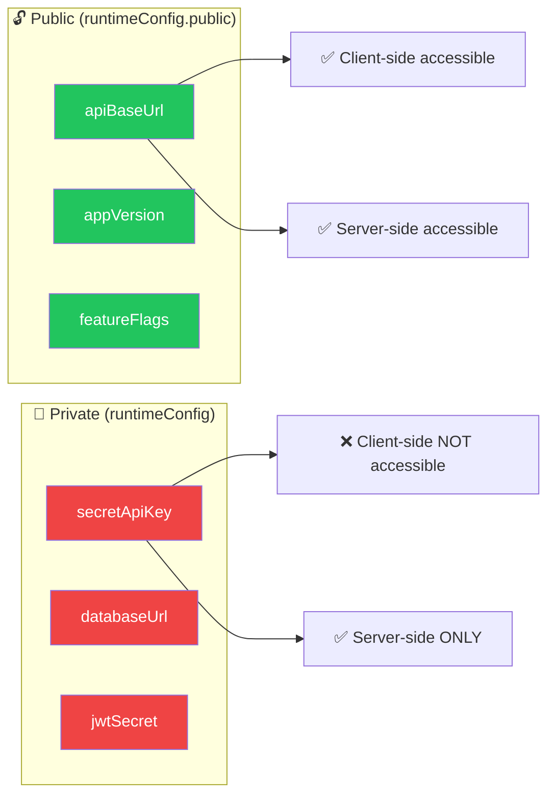

# Environment Variables — CRM Widget Frontend

> Dokumentasi lengkap environment variables yang digunakan dalam project **CRM Widget Frontend**.
> Dokumen ini ditulis dalam Bahasa Indonesia dengan istilah teknis dalam Bahasa Inggris.

---

## 📋 Daftar Isi

- [Overview](#-overview)
- [Variables Table](#-variables-table)
- [Usage in Code](#-usage-in-code)
- [Environment Files](#-environment-files)
- [Adding New Variables](#-adding-new-variables)
- [Security Notes](#-security-notes)

---

## 🔍 Overview

### Bagaimana Nuxt Menangani Environment Variables

Nuxt menggunakan `runtimeConfig` di `nuxt.config.ts` sebagai satu-satunya cara untuk mengakses environment variables di dalam aplikasi:

```typescript
// nuxt.config.ts
export default defineNuxtConfig({
  runtimeConfig: {
    // ❌ Private — hanya tersedia di server-side (SSR, API routes)
    secretApiKey: '',

    // ✅ Public — tersedia di client-side DAN server-side
    public: {
      apiBaseUrl: process.env.NUXT_PUBLIC_API_BASE_URL || 'http://localhost:3000/api',
    },
  },
})
```

### Mekanisme Kerja

1. **Definisi** — Deklarasikan variable di `runtimeConfig` dalam `nuxt.config.ts`
2. **Default value** — Berikan default value di kode (untuk development)
3. **Override** — Override via environment variable dengan prefix `NUXT_`
4. **Akses** — Gunakan `useRuntimeConfig()` composable di dalam aplikasi

### Override Convention

Nuxt secara otomatis memetakan environment variable ke `runtimeConfig` berdasarkan aturan berikut:

```
runtimeConfig key           → Environment Variable
──────────────────────────────────────────────────
public.apiBaseUrl           → NUXT_PUBLIC_API_BASE_URL
public.someNestedValue      → NUXT_PUBLIC_SOME_NESTED_VALUE
secretKey                   → NUXT_SECRET_KEY
```

Aturan transformasi:
- Prefix `NUXT_` ditambahkan
- `public.` menjadi `NUXT_PUBLIC_`
- camelCase diubah menjadi UPPER_SNAKE_CASE

---

## 📊 Variables Table

### Public Variables (Client-Side Accessible)

| Variable | Type | Default | Required | Deskripsi |
|----------|------|---------|----------|-----------|
| `NUXT_PUBLIC_API_BASE_URL` | `string` | `http://localhost:3000/api` | ✅ Yes | Base URL untuk Backend API. Semua API service menggunakan URL ini sebagai prefix untuk HTTP requests. |

### Runtime Config Mapping

| Environment Variable | Runtime Config Path | Akses via |
|---------------------|---------------------|-----------|
| `NUXT_PUBLIC_API_BASE_URL` | `runtimeConfig.public.apiBaseUrl` | `useRuntimeConfig().public.apiBaseUrl` |

> **Catatan:** Saat ini project hanya memiliki satu environment variable. Tabel ini akan bertambah seiring berkembangnya project.

---

## 💻 Usage in Code

### Akses di Composables / Services

```typescript
// ✅ Benar — menggunakan useRuntimeConfig()
const config = useRuntimeConfig()
const apiUrl = config.public.apiBaseUrl
// → 'http://localhost:3000/api' (default)
// → atau value dari NUXT_PUBLIC_API_BASE_URL
```

### Akses di BaseApiService

`BaseApiService` sudah menggunakan `runtimeConfig` untuk base URL:

```typescript
// app/services/BaseApiService.ts
export abstract class BaseApiService {
  protected readonly http: AxiosInstance

  constructor(baseURL?: string) {
    this.http = axios.create({
      baseURL: baseURL ?? this.getBaseUrl(),
      timeout: 30000,
      headers: {
        'Content-Type': 'application/json',
        'Accept': 'application/json',
      },
    })
  }

  private getBaseUrl(): string {
    try {
      const config = useRuntimeConfig()
      return config.public.apiBaseUrl as string
    }
    catch {
      return 'http://localhost:3000/api'
    }
  }
}
```

Semua service yang extends `BaseApiService` otomatis menggunakan `apiBaseUrl` yang benar.

### Akses di Vue Components

```vue
<script setup lang="ts">
const config = useRuntimeConfig()

// ✅ Public config — bisa diakses di client
const apiBaseUrl = config.public.apiBaseUrl
</script>

<template>
  <p>API URL: {{ config.public.apiBaseUrl }}</p>
</template>
```

### Type Safety

Nuxt secara otomatis men-generate TypeScript types untuk `runtimeConfig`. Anda bisa menambahkan type augmentation jika diperlukan:

```typescript
// Nuxt auto-generates types dari nuxt.config.ts runtimeConfig
// Akses langsung sudah type-safe:
const config = useRuntimeConfig()
config.public.apiBaseUrl // ✅ TypeScript knows this is string
```

---

## 📄 Environment Files

### File Hierarchy

| File | Deskripsi | Git Status |
|------|-----------|------------|
| `.env` | Environment variables untuk local development | ❌ **NEVER commit** (ada di `.gitignore`) |
| `.env.example` | Template dengan semua variables dan deskripsi | ✅ **ALWAYS commit** |
| `.env.production` | Override untuk production deployment | ❌ Managed by CI/CD |
| `.env.staging` | Override untuk staging deployment | ❌ Managed by CI/CD |

### `.env` — Local Development

File ini berisi actual values untuk development lokal. **JANGAN PERNAH** commit file ini.

```bash
# .env (local — tidak di-commit)

# Backend API base URL
NUXT_PUBLIC_API_BASE_URL=http://localhost:3000/api
```

### `.env.example` — Template (Committed)

File ini berfungsi sebagai **dokumentasi** dan **template** untuk developer baru.
Berisi semua variable yang diperlukan beserta deskripsi dan default values.

```bash
# .env.example (committed to Git)

# Environment Variables
#
# Copy this file to .env and fill in the values.
# NEVER commit .env to version control.
#
# @see https://nuxt.com/docs/guide/directory-structure/env

# ============================================
# API Configuration
# ============================================

# Backend API base URL
NUXT_PUBLIC_API_BASE_URL=http://localhost:3000/api
```

### `.env.production` — Production

```bash
# .env.production

# Production API URL
NUXT_PUBLIC_API_BASE_URL=https://api.yourdomain.com/api
```

### `.env.staging` — Staging

```bash
# .env.staging

# Staging API URL
NUXT_PUBLIC_API_BASE_URL=https://staging-api.yourdomain.com/api
```

### Setup untuk Developer Baru

```bash
# 1. Clone project
git clone <repo-url>
cd crm-widget-fe

# 2. Copy environment template
cp .env.example .env

# 3. Edit .env sesuai kebutuhan lokal
# (biasanya default values sudah cukup untuk development)

# 4. Install dependencies
bun install

# 5. Jalankan development server
bun run dev
```

---

## ➕ Adding New Variables

### Step-by-Step Guide

Saat menambahkan environment variable baru, ikuti langkah berikut:

#### 1. Tambahkan ke `nuxt.config.ts`

```typescript
// nuxt.config.ts
export default defineNuxtConfig({
  runtimeConfig: {
    // Private (server-only)
    newSecretKey: process.env.NUXT_NEW_SECRET_KEY || '',

    public: {
      // Public (client + server)
      apiBaseUrl: process.env.NUXT_PUBLIC_API_BASE_URL || 'http://localhost:3000/api',
      newPublicVar: process.env.NUXT_PUBLIC_NEW_PUBLIC_VAR || 'default-value',  // ← baru
    },
  },
})
```

#### 2. Tambahkan ke `.env.example`

```bash
# .env.example

# ============================================
# API Configuration
# ============================================

# Backend API base URL
NUXT_PUBLIC_API_BASE_URL=http://localhost:3000/api

# New public variable description
NUXT_PUBLIC_NEW_PUBLIC_VAR=default-value
```

#### 3. Tambahkan ke `.env` lokal

```bash
# .env (local)
NUXT_PUBLIC_NEW_PUBLIC_VAR=my-local-value
```

#### 4. Update dokumen ini

Tambahkan entry baru ke [Variables Table](#-variables-table):

```markdown
| `NUXT_PUBLIC_NEW_PUBLIC_VAR` | `string` | `default-value` | No | Deskripsi variable baru |
```

#### 5. Update `CHANGELOG.md`

```markdown
## [Unreleased]

### Changed
- Added `NUXT_PUBLIC_NEW_PUBLIC_VAR` environment variable for [purpose]
```

#### 6. Restart Dev Server

Setelah mengubah environment variables, **restart** development server:

```bash
# Ctrl+C untuk stop, lalu
bun run dev
```

> **Penting:** Perubahan pada `.env` memerlukan restart server. Hot reload **TIDAK** berlaku untuk environment variables.

---

## 🔒 Security Notes

### Public vs Private Config



### Aturan Keamanan

| Aturan | Penjelasan |
|--------|------------|
| ❌ **JANGAN** taruh secrets di `public` | Data di `runtimeConfig.public` bisa dibaca oleh siapa saja di browser |
| ✅ Gunakan `runtimeConfig` (non-public) untuk secrets | Hanya tersedia di server-side (SSR, API routes di `server/`) |
| ❌ **JANGAN** commit `.env` ke Git | File ini ada di `.gitignore` untuk alasan keamanan |
| ✅ **SELALU** commit `.env.example` | Sebagai template dan dokumentasi untuk developer lain |
| ✅ Gunakan `NUXT_` prefix | Nuxt hanya membaca env vars dengan prefix `NUXT_` untuk runtimeConfig |
| ❌ **JANGAN** akses `process.env` langsung di app code | Selalu gunakan `useRuntimeConfig()` |

### Contoh yang Benar vs Salah

```typescript
// ❌ SALAH — langsung akses process.env di client code
const apiUrl = process.env.NUXT_PUBLIC_API_BASE_URL

// ✅ BENAR — gunakan useRuntimeConfig()
const config = useRuntimeConfig()
const apiUrl = config.public.apiBaseUrl
```

```typescript
// ❌ SALAH — secret di public config
runtimeConfig: {
  public: {
    secretApiKey: 'sk-xxxx',  // ❌ Bisa dibaca di browser!
  },
}

// ✅ BENAR — secret di private config
runtimeConfig: {
  secretApiKey: 'sk-xxxx',    // ✅ Hanya tersedia di server
  public: {
    apiBaseUrl: '...',        // ✅ Aman untuk public
  },
}
```

### Verifikasi Keamanan

Untuk memastikan secrets tidak terexpose di client:

1. Buka browser DevTools → Network tab
2. Load halaman dan inspect response `_payload.json` atau initial HTML
3. Pastikan **TIDAK ADA** secret values yang muncul
4. Atau check di Console: `useRuntimeConfig()` — hanya `public` yang tersedia

---

## 📚 Referensi

- [Nuxt Runtime Config](https://nuxt.com/docs/guide/going-further/runtime-config)
- [Nuxt Environment Variables](https://nuxt.com/docs/guide/directory-structure/env)
- [nuxt.config.ts](../nuxt.config.ts) — Konfigurasi runtimeConfig aktual
- [.env.example](../.env.example) — Template environment variables
- [ARCHITECTURE.md](../ARCHITECTURE.md) — Arsitektur project
