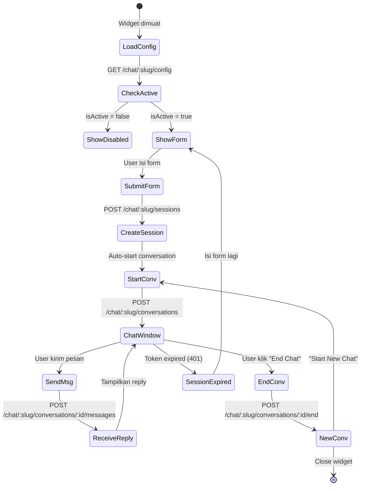

# PRD — CRM Chatbot System (Frontend)

> **Version**: 1.0.0 | **Backend Version**: 0.4.0  
> **Audience**: Frontend Developer, AI Agent Frontend  
> **Backend Base URL**: `http://localhost:3000`  
> **API Prefix**: `/api`

---

## 1. Ringkasan Produk

Sistem chatbot multi-tenant yang dapat di-embed sebagai widget di website pelanggan. Chatbot menggunakan **Google ADK** (Agent Development Kit) + **Gemini** untuk RAG (Retrieval-Augmented Generation) dengan knowledge base yang dikelola melalui admin dashboard.

### Dua Deliverable Frontend

| # | Deliverable | Teknologi | Deskripsi |
|---|------------|-----------|-----------|
| 1 | **Chat Widget** | Embeddable JS widget | Widget chat publik yang di-embed di website pelanggan via `<script>` tag |
| 2 | **Admin Dashboard** | Web app (React/Next.js/Vite) | Dashboard untuk mengelola settings, form fields, knowledge base, conversations, dan playground |

---

## 2. Arsitektur Sistem

```
┌─────────────────────────────────────────────────────┐
│                   Admin Dashboard                    │
│  (JWT Auth — Bearer Token + requireTenant)           │
│                                                      │
│  ┌──────────┐ ┌──────────┐ ┌──────────┐ ┌────────┐ │
│  │ Widget   │ │ Chatbot  │ │Knowledge │ │Conver- │ │
│  │ Settings │ │ Settings │ │   Base   │ │sations │ │
│  └──────────┘ └──────────┘ └──────────┘ └────────┘ │
│  ┌──────────┐ ┌──────────┐ ┌──────────┐            │
│  │  Form    │ │ Sessions │ │Playground│            │
│  │  Fields  │ │          │ │          │            │
│  └──────────┘ └──────────┘ └──────────┘            │
└─────────────────────────────────────────────────────┘

┌─────────────────────────────────────────────────────┐
│                  Chat Widget (Public)                 │
│  (No JWT — Session Token via X-Session-Token header) │
│                                                      │
│  ┌──────────┐ ┌──────────┐ ┌──────────┐            │
│  │Pre-chat  │→│  Chat    │→│  End     │            │
│  │  Form    │ │  Window  │ │  Chat    │            │
│  └──────────┘ └──────────┘ └──────────┘            │
└─────────────────────────────────────────────────────┘
```

---

## 3. Response Format (Semua API)

### 3.1 Success Response (Single Item)

```json
{
  "success": true,
  "statusCode": 200,
  "message": "Success",
  "data": { ... }
}
```

### 3.2 Success Response (Created)

```json
{
  "success": true,
  "statusCode": 201,
  "message": "Created successfully",
  "data": { ... }
}
```

### 3.3 Success Response (Paginated)

```json
{
  "success": true,
  "statusCode": 200,
  "message": "Success",
  "data": [ ... ],
  "meta": {
    "total": 45,
    "perPage": 10,
    "currentPage": 1,
    "lastPage": 5,
    "from": 1,
    "to": 10
  }
}
```

### 3.4 Error Response

```json
{
  "success": false,
  "statusCode": 400,
  "message": "Error message",
  "data": null,
  "errors": {
    "fieldName": ["Error detail 1", "Error detail 2"]
  }
}
```

### 3.5 Error Codes

| Status | Arti | Kapan Terjadi |
|--------|-------|---------------|
| `400` | Bad Request | Validasi gagal, parameter salah |
| `401` | Unauthorized | JWT expired, session expired/invalid |
| `403` | Forbidden | Tidak punya akses (role) |
| `404` | Not Found | Resource tidak ditemukan |
| `409` | Conflict | Duplikat data |
| `422` | Unprocessable Entity | Zod validation error |
| `500` | Internal Server Error | Server error |

---

## 4. Autentikasi

### 4.1 Admin Dashboard (JWT)

```
Authorization: Bearer <accessToken>
```

- Login via `POST /api/auth/login` → mendapat `accessToken` + `refreshToken`
- Token expired → refresh via `POST /api/auth/refresh`
- Semua admin endpoint membutuhkan JWT + tenant aktif (dipilih saat login/switch)

### 4.2 Chat Widget (Session Token)

```
X-Session-Token: <sessionToken>
```

- Tidak perlu JWT
- Session token didapat setelah submit pre-chat form
- Token expired setelah N menit (default 10), di-reset setiap kali chat
- Session token dikirim via header `X-Session-Token`

---

## 5. DELIVERABLE 1 — Chat Widget (Public)

### 5.1 User Flow



### 5.2 Embedding

Widget akan di-embed via script tag:

```html
<script src="https://cdn.example.com/widget.js" data-tenant="tenant-slug"></script>
```

Widget harus:
- Membuat floating button di pojok kanan bawah
- Membuka chat window saat di-klik
- Menyimpan `sessionToken` di `localStorage`
- Auto-recover session jika token masih valid

### 5.3 API Endpoints — Chat Widget

#### 5.3.1 Get Widget Config

```
GET /api/chat/{tenantSlug}/config
```

**Auth**: Tidak perlu  
**Response**:
```json
{
  "success": true,
  "statusCode": 200,
  "message": "Success",
  "data": {
    "tenantName": "",
    "welcomeMessage": "Hello! How can we help you today?",
    "primaryColor": "#6366f1",
    "fontFamily": "Inter",
    "iconPath": null,
    "isActive": true,
    "formFields": [
      {
        "fieldName": "name",
        "label": "Name",
        "fieldType": "text",
        "placeholder": "Enter your name",
        "options": null,
        "isRequired": true,
        "sortOrder": 0
      },
      {
        "fieldName": "email",
        "label": "Email",
        "fieldType": "email",
        "placeholder": "Enter your email",
        "options": null,
        "isRequired": true,
        "sortOrder": 1
      }
    ]
  }
}
```

**Field `formFields`** digunakan untuk render pre-chat form secara dinamis.

| Field | Type | Deskripsi |
|-------|------|-----------|
| `fieldName` | `string` | Key untuk submit (e.g., `name`, `email`, `phone`) |
| `label` | `string` | Label yang ditampilkan |
| `fieldType` | `enum` | `text`, `email`, `phone`, `number`, `textarea`, `select` |
| `placeholder` | `string?` | Placeholder text |
| `options` | `object?` | Opsi untuk `select` type (format: `{ "value1": "Label 1", "value2": "Label 2" }`) |
| `isRequired` | `boolean` | Wajib diisi? |
| `sortOrder` | `number` | Urutan tampil (ascending) |

#### 5.3.2 Create Session (Submit Form)

```
POST /api/chat/{tenantSlug}/sessions
Content-Type: application/json
```

**Auth**: Tidak perlu  
**Request Body**: Dynamic key-value pairs sesuai form fields

```json
{
  "name": "John Doe",
  "email": "john@example.com"
}
```

**Response** (`201`):
```json
{
  "success": true,
  "statusCode": 201,
  "message": "Session created successfully",
  "data": {
    "id": "uuid",
    "sessionToken": "aB3cD4eF5gH6iJ7kL8mN9oP0qR1sT2uV3wX4yZ...",
    "ipAddress": "192.168.1.1",
    "userAgent": "Mozilla/5.0...",
    "expiresAt": "2026-06-14T13:10:00.000Z",
    "lastActivityAt": "2026-06-14T13:00:00.000Z",
    "values": {
      "name": "John Doe",
      "email": "john@example.com"
    },
    "createdAt": "2026-06-14T13:00:00.000Z",
    "updatedAt": "2026-06-14T13:00:00.000Z"
  }
}
```

> [!IMPORTANT]
> Simpan `sessionToken` di `localStorage`. Gunakan untuk semua request berikutnya via header `X-Session-Token`.

#### 5.3.3 Get Session (Recover)

```
GET /api/chat/{tenantSlug}/sessions/{token}
```

**Auth**: Tidak perlu  
**Response**: Sama seperti create session response.  
**Error `404`**: Token tidak ditemukan → tampilkan form lagi.

#### 5.3.4 Start Conversation

```
POST /api/chat/{tenantSlug}/conversations
X-Session-Token: <sessionToken>
```

**Auth**: Session token via header  
**Response** (`201`):
```json
{
  "success": true,
  "statusCode": 201,
  "message": "Conversation started",
  "data": {
    "id": "conversation-uuid",
    "sessionId": "session-uuid",
    "status": "active",
    "totalMessages": 0,
    "promptTokens": 0,
    "completionTokens": 0,
    "totalTokens": 0,
    "startedAt": "2026-06-14T13:00:00.000Z",
    "endedAt": null,
    "createdAt": "2026-06-14T13:00:00.000Z",
    "updatedAt": "2026-06-14T13:00:00.000Z"
  }
}
```

> [!IMPORTANT]
> Simpan `conversationId` (`data.id`) di state. Gunakan untuk send message dan end conversation.

#### 5.3.5 Send Message ⭐ (Core Endpoint)

```
POST /api/chat/{tenantSlug}/conversations/{convId}/messages
X-Session-Token: <sessionToken>
Content-Type: application/json
```

**Request Body**:
```json
{
  "message": "Apa saja produk yang tersedia?"
}
```

**Validasi**:
- `message`: string, min 1 karakter, max 5000 karakter

**Response**:
```json
{
  "success": true,
  "statusCode": 200,
  "message": "Success",
  "data": {
    "reply": "Berikut adalah produk yang tersedia:\n1. Internet Fiber 10 Mbps\n2. Internet Fiber 20 Mbps\n...",
    "sources": [
      {
        "id": "kb-uuid",
        "title": "Daftar Produk Internet",
        "content": "Produk internet fiber...",
        "categoryId": "cat-uuid",
        "entryType": "faq",
        "distance": 0.15
      }
    ],
    "conversationId": "conv-uuid",
    "promptTokens": 245,
    "completionTokens": 128,
    "totalTokens": 373,
    "latencyMs": 1523
  }
}
```

**Field Penting**:

| Field | Type | Deskripsi |
|-------|------|-----------|
| `reply` | `string` | Jawaban dari AI (bisa mengandung Markdown) |
| `sources` | `array` | Knowledge base yang digunakan AI untuk menjawab (bisa kosong jika jawab dari konteks) |
| `sources[].distance` | `number` | Jarak cosine (semakin kecil = semakin relevan, 0-1) |
| `latencyMs` | `number` | Waktu respons AI dalam ms |

> [!TIP]
> - Tampilkan `reply` dengan Markdown renderer
> - Tampilkan `sources` sebagai "Referensi" expandable di bawah reply
> - Tampilkan loading indicator saat menunggu response (bisa 2-5 detik)
> - Setiap message otomatis me-reset session expiry

#### 5.3.6 End Conversation

```
POST /api/chat/{tenantSlug}/conversations/{convId}/end
X-Session-Token: <sessionToken>
```

**Response**:
```json
{
  "success": true,
  "statusCode": 200,
  "message": "Conversation ended",
  "data": {
    "id": "conv-uuid",
    "status": "ended",
    "endedAt": "2026-06-14T13:30:00.000Z",
    "totalMessages": 8,
    "totalTokens": 2456
  }
}
```

> [!NOTE]
> Setelah end conversation, user bisa start conversation baru TANPA mengisi form lagi (session masih sama). Tampilkan tombol "Start New Chat".

### 5.4 Widget State Machine

```
┌─────────────────────────────────────────────────────┐
│                    Widget States                     │
├─────────────────────────────────────────────────────┤
│                                                      │
│  CLOSED ──────────► LOADING_CONFIG                   │
│    ▲                    │                            │
│    │                    ▼                            │
│    │              SHOW_FORM ◄──── SESSION_EXPIRED    │
│    │                    │              ▲              │
│    │                    ▼              │              │
│    │              CREATING_SESSION     │              │
│    │                    │              │              │
│    │                    ▼              │              │
│    │              CHAT_ACTIVE ────────┘              │
│    │                    │                            │
│    │                    ▼                            │
│    │              CHAT_ENDED                         │
│    │                    │                            │
│    │                    ├──► NEW_CONVERSATION         │
│    │                    │       │                     │
│    └────────────────────┘       └──► CHAT_ACTIVE     │
│                                                      │
└─────────────────────────────────────────────────────┘
```

### 5.5 Widget Component Spec

```
ChatWidget/
├── FloatingButton         # Tombol bulat di pojok kanan bawah
│   ├── Icon (dari iconPath atau default)
│   └── Unread badge (opsional)
│
├── ChatWindow             # Panel chat utama
│   ├── Header
│   │   ├── Tenant name / icon
│   │   ├── Status indicator (online/offline)
│   │   └── Close button (X)
│   │
│   ├── PreChatForm        # Ditampilkan sebelum session
│   │   ├── Welcome message
│   │   ├── Dynamic form fields (berdasarkan config)
│   │   └── "Start Chat" button
│   │
│   ├── MessageList        # Scrollable message area
│   │   ├── UserMessage    # Bubble kanan (warna primaryColor)
│   │   ├── BotMessage     # Bubble kiri (dengan markdown renderer)
│   │   │   ├── Content (Markdown)
│   │   │   └── Sources (expandable accordion)
│   │   ├── TypingIndicator # Animasi "..." saat loading
│   │   └── SystemMessage  # "Conversation started" dll
│   │
│   ├── InputArea          # Bottom sticky
│   │   ├── Text input (max 5000 chars)
│   │   ├── Send button
│   │   └── Character count (opsional)
│   │
│   └── Footer
│       ├── "End Chat" button
│       └── "Powered by" branding (opsional)
│
└── SessionExpiredOverlay  # Overlay saat session expired
    ├── Message "Session expired"
    └── "Start New Session" button → kembali ke form
```

### 5.6 Widget Styling (dari Config)

Widget harus menggunakan config dari `GET /config`:

| Config Field | CSS Mapping | Default |
|-------------|-------------|---------|
| `primaryColor` | Button bg, user message bg, accent color | `#6366f1` |
| `fontFamily` | `font-family` (load dari Google Fonts) | `Inter` |
| `iconPath` | Floating button icon / header avatar | Default chat icon |
| `welcomeMessage` | Text di atas pre-chat form | "Hello! How can we help you today?" |

### 5.7 LocalStorage Keys

| Key | Value | Lifecycle |
|-----|-------|-----------|
| `crm_widget_session_{tenantSlug}` | `sessionToken` string | Dibuat saat create session, dihapus saat expired |
| `crm_widget_conv_{tenantSlug}` | `conversationId` string | Dibuat saat start conversation, dihapus saat end |

### 5.8 Error Handling — Widget

| Error | Status | Action |
|-------|--------|--------|
| Widget disabled | `isActive=false` | Sembunyikan widget / tampilkan "Chat offline" |
| Session expired | `401` | Tampilkan form lagi, hapus localStorage |
| Network error | - | Tampilkan retry button |
| Server error | `500` | "Terjadi kesalahan, coba lagi" |
| Empty message | client | Disable send button jika kosong |
| Rate limit | `429` | "Terlalu banyak pesan, tunggu sebentar" |

---

## 6. DELIVERABLE 2 — Admin Dashboard

### 6.1 Navigasi Menu

```
Dashboard
├── Chatbot
│   ├── Widget Settings      ← /chatbot/widget
│   ├── Chatbot Settings     ← /chatbot/settings
│   ├── Form Fields          ← /chatbot/form-fields
│   └── Playground           ← /chatbot/playground
├── Knowledge Base
│   ├── Categories           ← /knowledge
│   └── (KB entries nested)
├── Conversations
│   ├── All Conversations    ← /conversations
│   └── Sessions             ← /sessions
└── (existing menus)
    ├── Contacts
    └── Settings
```

---

### 6.2 Halaman: Widget Settings

**URL**: `/chatbot/widget`  
**API**: `GET /api/widget-settings` + `PUT /api/widget-settings`

#### 6.2.1 UI Spec

Form dengan live preview:

```
┌─────────────────────────────────────────────────────┐
│                  Widget Settings                     │
├──────────────────────┬──────────────────────────────┤
│                      │                              │
│  Welcome Message     │    ┌─────────────────────┐   │
│  [textarea]          │    │  LIVE PREVIEW       │   │
│                      │    │                     │   │
│  Icon                │    │  ┌─────────────┐    │   │
│  [file upload]       │    │  │ Chat Widget │    │   │
│                      │    │  │ Preview     │    │   │
│  Primary Color       │    │  │             │    │   │
│  [color picker]      │    │  │             │    │   │
│  #6366f1             │    │  └─────────────┘    │   │
│                      │    │                     │   │
│  Font Family         │    └─────────────────────┘   │
│  [dropdown]          │                              │
│                      │                              │
│  Session Timeout     │                              │
│  [number] minutes    │                              │
│                      │                              │
│  Active              │                              │
│  [toggle]            │                              │
│                      │                              │
│  [Save Changes]      │                              │
│                      │                              │
└──────────────────────┴──────────────────────────────┘
```

#### 6.2.2 API Contract

**GET** `/api/widget-settings`

```
Authorization: Bearer <token>
```

Response:
```json
{
  "success": true,
  "statusCode": 200,
  "data": {
    "id": "uuid",
    "welcomeMessage": "Hello! How can we help you today?",
    "iconPath": null,
    "primaryColor": "#6366f1",
    "fontFamily": "Inter",
    "sessionTimeout": 10,
    "isActive": true,
    "createdAt": "2026-06-14T13:00:00.000Z",
    "updatedAt": "2026-06-14T13:00:00.000Z"
  }
}
```

**PUT** `/api/widget-settings`

```json
{
  "welcomeMessage": "Selamat datang! Ada yang bisa dibantu?",
  "primaryColor": "#8b5cf6",
  "fontFamily": "Poppins",
  "sessionTimeout": 15,
  "isActive": true
}
```

> [!NOTE]
> Semua field opsional di PUT. Hanya kirim field yang berubah.

---

### 6.3 Halaman: Chatbot Settings

**URL**: `/chatbot/settings`  
**API**: `GET /api/chatbot-settings` + `PUT /api/chatbot-settings`

#### 6.3.1 UI Spec

```
┌─────────────────────────────────────────────────────┐
│                Chatbot Settings                      │
├─────────────────────────────────────────────────────┤
│                                                      │
│  System Instruction                                  │
│  [large textarea — monospace font]                   │
│  "You are a helpful customer support assistant..."   │
│                                                      │
│  ─── Model Configuration ───                        │
│                                                      │
│  Model              Embedding Model                  │
│  [gemini-2.0-flash] [text-embedding-004]            │
│                                                      │
│  Temperature         Max Output Tokens               │
│  [slider 0-2]  0.7   [number input] 1024            │
│                                                      │
│  Top P               Top K                           │
│  [slider 0-1]  0.95  [number input] 40              │
│                                                      │
│  [Save Changes]                                      │
│                                                      │
└─────────────────────────────────────────────────────┘
```

#### 6.3.2 API Contract

**GET** `/api/chatbot-settings`

Response:
```json
{
  "data": {
    "id": "uuid",
    "systemInstruction": "You are a helpful customer support assistant.",
    "modelName": "gemini-2.0-flash",
    "embeddingModel": "text-embedding-004",
    "temperature": 0.7,
    "maxTokens": 1024,
    "topP": 0.95,
    "topK": 40,
    "createdAt": "...",
    "updatedAt": "..."
  }
}
```

**PUT** `/api/chatbot-settings`

```json
{
  "systemInstruction": "Kamu adalah asisten...",
  "temperature": 0.5,
  "maxTokens": 2048
}
```

**Validasi**:

| Field | Type | Min | Max | Default |
|-------|------|-----|-----|---------|
| `systemInstruction` | string | 1 | - | - |
| `modelName` | string | - | 100 | `gemini-2.0-flash` |
| `embeddingModel` | string | - | 100 | `text-embedding-004` |
| `temperature` | number | 0 | 2 | 0.7 |
| `maxTokens` | integer | 1 | - | 1024 |
| `topP` | number | 0 | 1 | 0.95 |
| `topK` | integer | 1 | - | 40 |

---

### 6.4 Halaman: Form Fields

**URL**: `/chatbot/form-fields`  
**API**: CRUD `/api/chatbot-form-fields`

#### 6.4.1 UI Spec

```
┌─────────────────────────────────────────────────────┐
│  Pre-Chat Form Fields                    [+ Add]     │
├─────────────────────────────────────────────────────┤
│                                                      │
│  ☰ Name          text      Required  ✏️ 🗑️          │
│  ☰ Email         email     Required  ✏️ 🗑️          │
│  ☰ Phone         phone     Optional  ✏️ 🗑️          │
│                                                      │
│  (drag handle ☰ untuk reorder)                      │
│                                                      │
│  ─── Preview ───                                    │
│  ┌─────────────────────┐                            │
│  │ Name *              │                            │
│  │ [                 ] │                            │
│  │ Email *             │                            │
│  │ [                 ] │                            │
│  │ Phone               │                            │
│  │ [                 ] │                            │
│  │                     │                            │
│  │ [Start Chat]        │                            │
│  └─────────────────────┘                            │
│                                                      │
└─────────────────────────────────────────────────────┘
```

#### 6.4.2 API Contract

**GET** `/api/chatbot-form-fields`

Response:
```json
{
  "data": [
    {
      "id": "uuid",
      "fieldName": "name",
      "label": "Name",
      "fieldType": "text",
      "placeholder": "Enter your name",
      "options": null,
      "isRequired": true,
      "sortOrder": 0,
      "isActive": true,
      "createdAt": "...",
      "updatedAt": "..."
    }
  ]
}
```

**POST** `/api/chatbot-form-fields`

```json
{
  "fieldName": "company",
  "label": "Company Name",
  "fieldType": "text",
  "placeholder": "Your company",
  "isRequired": false,
  "sortOrder": 2
}
```

**PUT** `/api/chatbot-form-fields/{id}`

```json
{
  "label": "Nama Lengkap",
  "placeholder": "Masukkan nama lengkap"
}
```

**DELETE** `/api/chatbot-form-fields/{id}`

**PUT** `/api/chatbot-form-fields/reorder`

```json
{
  "items": [
    { "id": "uuid-1", "sortOrder": 0 },
    { "id": "uuid-2", "sortOrder": 1 },
    { "id": "uuid-3", "sortOrder": 2 }
  ]
}
```

**Field Types Enum**:

| Value | Render As | Notes |
|-------|-----------|-------|
| `text` | `<input type="text">` | |
| `email` | `<input type="email">` | Client-side email validation |
| `phone` | `<input type="tel">` | |
| `number` | `<input type="number">` | |
| `textarea` | `<textarea>` | Multi-line |
| `select` | `<select>` | Gunakan `options` object untuk pilihan |

---

### 6.5 Halaman: Knowledge Base

**URL**: `/knowledge`  
**API**: CRUD `/api/knowledge-categories` + `/api/knowledge-bases`

#### 6.5.1 UI Spec — Kategori List

```
┌─────────────────────────────────────────────────────┐
│  Knowledge Base                        [+ Category]  │
├─────────────────────────────────────────────────────┤
│                                                      │
│  📁 Produk & Layanan            12 entries   ✏️ 🗑️   │
│  📁 FAQ                          8 entries   ✏️ 🗑️   │
│  📁 Kebijakan Perusahaan         5 entries   ✏️ 🗑️   │
│  📁 Troubleshooting              3 entries   ✏️ 🗑️   │
│                                                      │
└─────────────────────────────────────────────────────┘
```

#### 6.5.2 UI Spec — Category Detail (KB Entries)

```
┌─────────────────────────────────────────────────────┐
│  ← Produk & Layanan             [+ Add] [Bulk Import]│
├─────────────────────────────────────────────────────┤
│                                                      │
│  📄 Internet Fiber 10 Mbps         faq    ✏️ 🗑️     │
│  📄 Internet Fiber 20 Mbps         faq    ✏️ 🗑️     │
│  📄 Paket TV Kabel                 faq    ✏️ 🗑️     │
│                                                      │
│  ─── Add Entry ───                                  │
│  ┌─────────────────────────────────────────────┐    │
│  │ Title:   [                              ]   │    │
│  │ Content: [                              ]   │    │
│  │          [          large textarea      ]   │    │
│  │ Type:    [FAQ ▼]                            │    │
│  │                          [Cancel] [Save]    │    │
│  └─────────────────────────────────────────────┘    │
│                                                      │
└─────────────────────────────────────────────────────┘
```

#### 6.5.3 API Contract — Categories

**GET** `/api/knowledge-categories`

```json
{
  "data": [
    {
      "id": "uuid",
      "name": "Produk & Layanan",
      "description": "Informasi produk",
      "sortOrder": 0,
      "isActive": true,
      "knowledgeBaseCount": 12,
      "createdAt": "...",
      "updatedAt": "..."
    }
  ]
}
```

**POST** `/api/knowledge-categories`

```json
{
  "name": "Produk & Layanan",
  "description": "Informasi tentang produk dan layanan",
  "sortOrder": 0,
  "isActive": true
}
```

**GET** `/api/knowledge-categories/{id}` — detail + include KBs  
**PUT** `/api/knowledge-categories/{id}`  
**DELETE** `/api/knowledge-categories/{id}` — cascade delete semua KB di dalamnya

#### 6.5.4 API Contract — Knowledge Bases

**GET** `/api/knowledge-categories/{catId}/knowledge-bases` — list KB di kategori

**POST** `/api/knowledge-categories/{catId}/knowledge-bases` — create single KB

```json
{
  "title": "Internet Fiber 10 Mbps",
  "content": "Paket internet fiber optik dengan kecepatan up to 10 Mbps. Harga mulai dari Rp 199.000/bulan...",
  "entryType": "faq",
  "isActive": true
}
```

**POST** `/api/knowledge-categories/{catId}/knowledge-bases/bulk` — bulk import

```json
{
  "items": [
    { "title": "FAQ 1", "content": "Answer 1", "entryType": "faq" },
    { "title": "FAQ 2", "content": "Answer 2", "entryType": "faq" }
  ]
}
```

**GET** `/api/knowledge-bases/{id}` — KB detail  
**PUT** `/api/knowledge-bases/{id}` — update KB  
**DELETE** `/api/knowledge-bases/{id}` — delete KB

> [!IMPORTANT]
> Saat create/update KB, backend otomatis generate embedding (vector). Proses ini bisa memakan waktu 1-2 detik per entry. Untuk bulk import, tampilkan progress indicator.

**Entry Types**:

| Value | Deskripsi |
|-------|-----------|
| `faq` | FAQ / Q&A format |
| `document_chunk` | Potongan dokumen panjang |

---

### 6.6 Halaman: Conversations

**URL**: `/conversations`  
**API**: `/api/chatbot-conversations`

#### 6.6.1 UI Spec

```
┌─────────────────────────────────────────────────────┐
│  Conversations                                       │
├────────────────────┬────────────────────────────────┤
│ List               │ Detail                          │
│                    │                                 │
│ ● John Doe         │ Conversation with John Doe      │
│   8 msgs, active   │ Session: john@example.com       │
│   2 min ago        │ Status: active                  │
│                    │ Started: 14 Jun 20:00           │
│ ○ Jane Smith       │                                 │
│   12 msgs, ended   │ ┌─────────────────────────┐    │
│   1 hour ago       │ │ User: Apa produk yang   │    │
│                    │ │ tersedia?               │    │
│ ○ Ahmad            │ │                         │    │
│   3 msgs, ended    │ │ Bot: Berikut produk...  │    │
│   yesterday        │ │ [Sources: 2 refs]       │    │
│                    │ │                         │    │
│                    │ │ User: Berapa harganya?  │    │
│                    │ │                         │    │
│ [◀ 1 2 3 ▶]       │ │ Bot: Harga mulai dari...│    │
│                    │ └─────────────────────────┘    │
│                    │                                 │
│                    │ Stats: 373 tokens, 1.5s avg     │
│                    │                      [Delete]   │
└────────────────────┴────────────────────────────────┘
```

#### 6.6.2 API Contract

**GET** `/api/chatbot-conversations?page=1&perPage=10&session_id=optional`

Response (paginated):
```json
{
  "data": [
    {
      "id": "uuid",
      "sessionId": "session-uuid",
      "status": "active",
      "totalMessages": 8,
      "promptTokens": 1200,
      "completionTokens": 800,
      "totalTokens": 2000,
      "startedAt": "2026-06-14T13:00:00.000Z",
      "endedAt": null,
      "createdAt": "...",
      "updatedAt": "..."
    }
  ],
  "meta": { "total": 45, "perPage": 10, "currentPage": 1, "lastPage": 5, "from": 1, "to": 10 }
}
```

**GET** `/api/chatbot-conversations/{id}` — detail + messages array  
**GET** `/api/chatbot-conversations/{id}/messages?page=1&perPage=50` — paginated messages  
**DELETE** `/api/chatbot-conversations/{id}`

**Message format dalam detail response**:
```json
{
  "id": "uuid",
  "conversationId": "conv-uuid",
  "role": "user",
  "content": "Apa produk yang tersedia?",
  "promptTokens": 0,
  "completionTokens": 0,
  "totalTokens": 0,
  "latencyMs": null,
  "modelName": null,
  "createdAt": "..."
}
```

**Message roles**: `user`, `assistant`, `system`

---

### 6.7 Halaman: Sessions

**URL**: `/sessions`  
**API**: `/api/chatbot-sessions`

#### 6.7.1 UI Spec

Tabel paginated dengan filter:

```
┌─────────────────────────────────────────────────────┐
│  Chat Sessions                                       │
├─────────────────────────────────────────────────────┤
│                                                      │
│  Name     Email              IP         Expires  Act │
│  ─────────────────────────────────────────────────── │
│  John     john@example.com   192.168..  10 min   🗑️ │
│  Jane     jane@company.com   10.0.0.1   expired  🗑️ │
│  Ahmad    ahmad@mail.com     172.16..   5 min    🗑️ │
│                                                      │
│  [◀ 1 2 3 ▶]                                        │
│                                                      │
└─────────────────────────────────────────────────────┘
```

#### 6.7.2 API Contract

**GET** `/api/chatbot-sessions?page=1&perPage=10`

Response (paginated):
```json
{
  "data": [
    {
      "id": "uuid",
      "sessionToken": "aB3cD4...",
      "ipAddress": "192.168.1.1",
      "userAgent": "Mozilla/5.0...",
      "expiresAt": "2026-06-14T13:10:00.000Z",
      "lastActivityAt": "2026-06-14T13:05:00.000Z",
      "values": { "name": "John", "email": "john@example.com" },
      "createdAt": "...",
      "updatedAt": "..."
    }
  ],
  "meta": { ... }
}
```

**GET** `/api/chatbot-sessions/{id}` — detail  
**DELETE** `/api/chatbot-sessions/{id}` — delete session

> [!TIP]
> `values` object berisi data form yang diisi user. Key-nya dinamis sesuai form fields yang di-set admin.

---

### 6.8 Halaman: Playground

**URL**: `/chatbot/playground`  
**API**: `POST /api/playground`

#### 6.8.1 UI Spec

```
┌─────────────────────────────────────────────────────┐
│  Chatbot Playground                   [Clear History]│
├─────────────────────────────────────────────────────┤
│                                                      │
│  ┌─────────────────────────────────────────────┐    │
│  │                                             │    │
│  │  You: Halo, apa layanan yang tersedia?     │    │
│  │                                             │    │
│  │  Bot: Selamat datang! Kami menyediakan...  │    │
│  │  [Sources: Internet Fiber, TV Kabel]        │    │
│  │                                             │    │
│  │  You: Berapa harga internet 10 mbps?       │    │
│  │                                             │    │
│  │  Bot: Harga internet fiber 10 Mbps...      │    │
│  │  [Sources: Daftar Harga]                    │    │
│  │                                             │    │
│  └─────────────────────────────────────────────┘    │
│                                                      │
│  ┌────────────────────────────────────┐ [Send]      │
│  │ Type a message...                  │             │
│  └────────────────────────────────────┘             │
│                                                      │
│  Stats: 1.5s latency | 373 tokens | gemini-2.0-flash│
│                                                      │
└─────────────────────────────────────────────────────┘
```

#### 6.8.2 API Contract

**POST** `/api/playground`

```
Authorization: Bearer <token>
```

Request:
```json
{
  "message": "Halo, apa layanan yang tersedia?",
  "history": [
    { "role": "user", "content": "Pesan sebelumnya" },
    { "role": "assistant", "content": "Jawaban sebelumnya" }
  ]
}
```

Response:
```json
{
  "data": {
    "reply": "Selamat datang! Kami menyediakan...",
    "sources": [
      { "id": "uuid", "title": "Internet Fiber", "content": "...", "distance": 0.12 }
    ],
    "promptTokens": 245,
    "completionTokens": 128,
    "totalTokens": 373,
    "latencyMs": 1523
  }
}
```

> [!IMPORTANT]
> Playground mengelola `history` di client-side. Setiap kali mengirim pesan, kirim ulang seluruh history. Backend TIDAK menyimpan history playground.

---

## 7. Pagination Query Parameters

Semua endpoint paginated mendukung query params:

| Param | Type | Default | Min | Max | Deskripsi |
|-------|------|---------|-----|-----|-----------|
| `page` | integer | 1 | 1 | - | Halaman saat ini |
| `perPage` | integer | 10 | 1 | 100 | Item per halaman |
| `sortBy` | string | `createdAt` | - | - | Kolom untuk sorting |
| `sortOrder` | string | `DESC` | - | - | `ASC` atau `DESC` |
| `search` | string | - | - | - | Full-text search (jika didukung) |

---

## 8. Embed Code Generator

Admin dashboard harus punya halaman "Embed Code" yang menampilkan:

```html
<!-- Copy this code to your website -->
<script
  src="https://cdn.example.com/widget.js"
  data-tenant="your-tenant-slug"
  async
></script>
```

Tampilkan juga preview bagaimana widget akan muncul di website pelanggan.

---

## 9. Design System

### 9.1 Rekomendasi Warna

| Elemen | Light Mode | Dark Mode |
|--------|-----------|-----------|
| Background | `#ffffff` | `#0f172a` |
| Surface | `#f8fafc` | `#1e293b` |
| Primary | `#6366f1` (indigo) | `#818cf8` |
| Text | `#1e293b` | `#f1f5f9` |
| Text Muted | `#64748b` | `#94a3b8` |
| Border | `#e2e8f0` | `#334155` |
| Success | `#10b981` | `#34d399` |
| Error | `#ef4444` | `#f87171` |

### 9.2 Typography

- Heading: `Inter` / `Outfit` (Google Fonts)
- Body: `Inter`
- Monospace (system instruction): `JetBrains Mono` / `Fira Code`

---

## 10. Data Flow Lengkap — Widget Chat

```
1. Widget Load
   └─ GET /api/chat/{slug}/config
      └─ Jika isActive=false → sembunyikan
      └─ Jika isActive=true → cek localStorage

2. Check Session
   └─ Ada token di localStorage?
      ├─ Ya → GET /api/chat/{slug}/sessions/{token}
      │       ├─ 200 → session valid, skip form
      │       └─ 404 → session expired, hapus token, show form
      └─ Tidak → show form

3. Submit Form
   └─ POST /api/chat/{slug}/sessions
      └─ Simpan sessionToken di localStorage
      └─ Auto: POST /api/chat/{slug}/conversations
         └─ Simpan conversationId di state

4. Send Message
   └─ POST /api/chat/{slug}/conversations/{convId}/messages
      ├─ 200 → tampilkan reply + sources
      └─ 401 → session expired → show form

5. End Chat
   └─ POST /api/chat/{slug}/conversations/{convId}/end
      └─ Tampilkan: "Start New Chat" atau "Close"

6. New Chat (same session)
   └─ POST /api/chat/{slug}/conversations
      └─ New conversationId, history bersih

7. Session Expired
   └─ Hapus localStorage
   └─ Show form lagi
```

---

## 11. Non-Functional Requirements

| Requirement | Target |
|------------|--------|
| Widget bundle size | < 100KB gzipped |
| Widget load time | < 2 detik |
| Chat response time | < 5 detik (tergantung AI) |
| Browser support | Chrome, Firefox, Safari, Edge (2 versi terakhir) |
| Mobile responsive | Widget harus full-width di mobile |
| Accessibility | WCAG 2.1 Level AA |
| Keyboard navigation | Tab, Enter, Escape |
| Internationalization | Bahasa Indonesia + English (future) |

---

## 12. Catatan Implementasi

> [!CAUTION]
> **Session Token Security**: Jangan simpan session token di cookie. Gunakan `localStorage` karena widget berjalan di domain pelanggan (cross-origin). Header `X-Session-Token` aman dari CSRF.

> [!WARNING]
> **CORS**: Backend harus mengizinkan CORS dari domain pelanggan. Widget akan membuat request cross-origin.

> [!TIP]
> **Markdown Rendering**: Response AI (`reply`) bisa mengandung Markdown (bold, italic, list, code). Gunakan library seperti `marked` atau `react-markdown` untuk render.

> [!TIP]
> **Typing Indicator**: Tampilkan animasi "..." selama menunggu response AI. API call bisa memakan 2-5 detik.

> [!NOTE]
> **Rate Limiting**: Belum ada rate limiting di backend. Implementasikan debounce di client (minimal 1 detik antar pesan).
